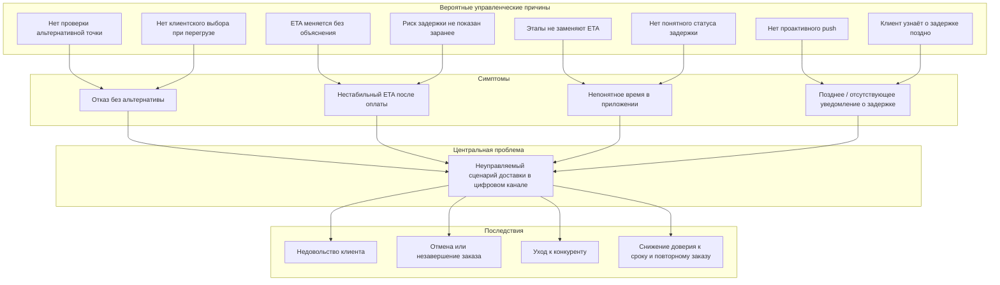
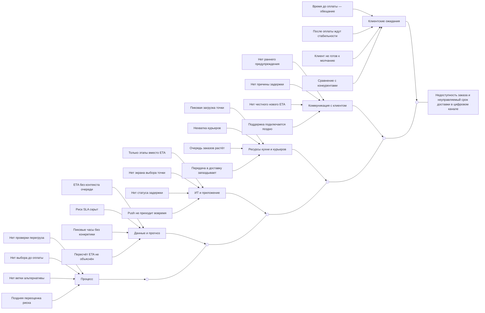
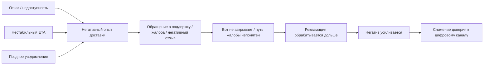
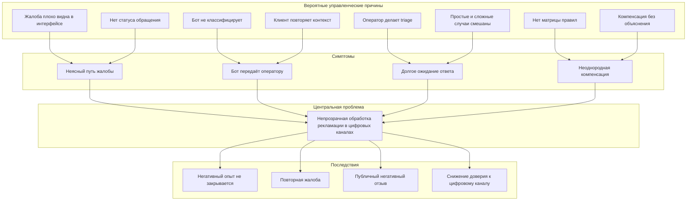
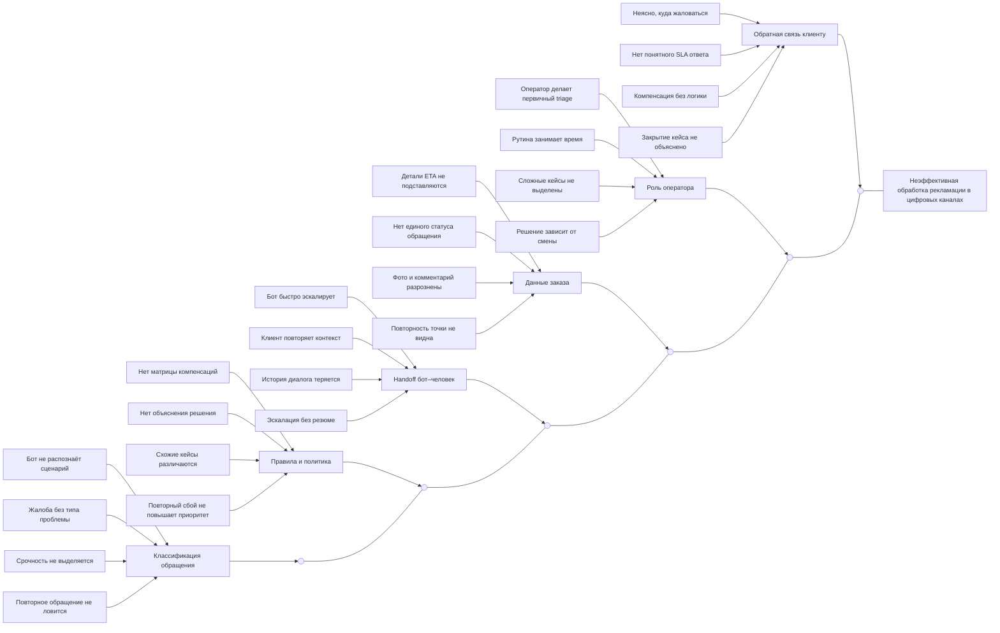

# Глава 2 курсовой ВШЭ по моделированию организации для Dodo Pizza и Dodo Brands

В данной главе проводится диагностика двух связанных проблемных линий цифрового клиентского пути Dodo Pizza: управления доступностью и сроком доставки в приложении и на сайте, а также обработки рекламаций по проблемному заказу. Официальное описание технологического контура Dodo Brands показывает, что Dodo IS объединяет customer mobile app, web site, contact center, order tracking и delivery management; следовательно, предмет анализа в курсовой корректно задавать как единый цифровой процесс, а не как два изолированных эпизода клиентского опыта. citeturn19view0turn4view1

Ниже факты, реконструкции и проектные решения сознательно разведены. Фактом считаются только данные опроса, тексты и коды публичных отзывов, а также сведения из открытых источников компании и методических материалов. Реконструкцией считаются нижние уровни деревьев проблем и диаграмм Ishikawa, где фиксируются вероятные управленческие причины, но не утверждаются внутренние регламенты Dodo. TO BE-элементы указываются только как мост к главе 3. Такое разделение соответствует зафиксированной рамке проекта и реестру допущений, где отдельно отмечено, что точные правила customer-facing ETA и поведение системы при перегрузе точки публично не раскрыты. fileciteturn0file3 fileciteturn0file6

## Постановка диагностической задачи

Диагностическая задача главы состоит в том, чтобы на эмпирической базе выявить, где в цифровом канале Dodo Pizza клиент теряет управляемость ожиданий по доставке, а затем показать, как этот сбой переходит в линию поддержки и рекламаций. Для первой линии ключевым вопросом является момент, в котором заказ либо становится недоступным без альтернативы, либо сохраняет формальную доступность, но перестает быть управляемым по сроку. Для второй линии вопрос смещается к прозрачности и единообразию обработки жалобы после проблемного заказа. fileciteturn0file3 fileciteturn0file4

Отдельно важно зафиксировать, что термин **SLA** в данной работе используется как аналитическая метка риска нарушения обещанного клиенту срока доставки внутри учебного проекта, а не как цитата из публичного регламента Dodo. Такое уточнение нужно, чтобы не подменять исследовательскую реконструкцию утверждением о действующих внутренних правилах компании. fileciteturn0file6

Для главы 2 диагностическая логика строится в три шага. Сначала из опроса и кодированных отзывов выделяются симптомы, которые действительно наблюдаются в выборке. Затем симптомы группируются в две линии и переводятся в центральные проблемные формулировки. После этого для целей главы 3 добавляются вероятные управленческие причины, но уже как гипотезы, а не как доказанные элементы внутренней архитектуры Dodo. fileciteturn0file0 fileciteturn0file2 fileciteturn0file6

**Таблица 2.1. Диагностический контур главы 2**

| Диагностическая линия | Центральный вопрос                                                       | Эмпирические индикаторы                                                                                                             | Единица анализа                                        | Выход для главы 3                         |
| --------------------- | ------------------------------------------------------------------------ | ----------------------------------------------------------------------------------------------------------------------------------- | ------------------------------------------------------ | ----------------------------------------- |
| ETA / доступность     | Где цифровой сценарий доставки становится неуправляемым для клиента?     | Q2, Q3, Q4, Q6; коды `задержка`, `ETA_несовпадение`, `ETA_неясен`, `отказ_недоступность`, `нет_уведомления`, `альтернативная_точка` | Проблемный заказ на доставку в приложении или на сайте | Полный BPMN AS IS / TO BE по процессу № 1 |
| Рекламации            | Где жалоба по проблемному заказу становится непрозрачной и неоднородной? | Q5, Q5а; коды `поддержка_непонятно`, `поддержка_долго`, `чат_оператор`, `компенсация`, `повторная_проблема`                         | Цифровое обращение клиента после проблемного заказа    | Упрощенная TO BE-модель по процессу № 2   |

Источник: составлено автором по рамке проекта, агрегатам опроса и таблице кодирования отзывов. fileciteturn0file3 fileciteturn0file0 fileciteturn0file2

## Методология исследования

Эмпирическая часть главы основана на сочетании короткого количественного инструмента и малого качественного корпуса. Такой дизайн нужен потому, что опрос отвечает на вопрос о частотности и распространенности симптомов в учебной выборке, а кодированные отзывы — на вопрос о том, как сами клиенты формулируют проблему и какие переходы между линиями реально встречаются в текстах. В самих материалах проекта это различие сформулировано прямо: опрос дает частоты, отзывы — формулировки и цитаты. Интервью в фактическую базу главы не включаются. fileciteturn0file0 fileciteturn0file1 fileciteturn0file7

**Методы.** В исследовании использованы: анализ открытых материалов проекта и компании; опрос Google Forms; вторичный анализ и ручное кодирование 10 публичных отзывов; дерево проблем; диаграмма причин и следствий Ishikawa; последующее ранжирование процессов для выбора методологии моделирования в главе 3. Для Ishikawa такая связка методически оправдана: ASQ определяет fishbone как инструмент, который помогает выявить множество возможных причин проблемы, сортируя их по полезным категориям, и отдельно подчеркивает, что категории могут быть адаптированы под конкретный контекст, а не сводиться к каноническим «6М» производственного анализа. fileciteturn0file5 fileciteturn0file7 citeturn13view0

**Сбор данных.** Опрос проводился 09–10.06.2026; всего получено 83 ответа, из них 77 — от респондентов с опытом Dodo Pizza. Вопросник включал блоки Q1–Q6: частота заказов, задержки, отказ или недоступность доставки, понятность времени в приложении, опыт обращения в поддержку, проблемы с ботом или чатом и готовность принять доставку из другой точки при честном ETA. Корпус отзывов включает 10 публичных текстов за период с сентября 2025 года по март 2026 года; эти отзывы были вручную размечены по тематическому кодбуку, который разделяет линию ETA/доступности и линию рекламаций. fileciteturn0file0 fileciteturn0file1 fileciteturn0file2

**Обработка данных.** На количественном этапе использованы готовые агрегаты вопросника и частоты по каждому вопросу. На качественном этапе применено ручное кодирование по заранее зафиксированному справочнику кодов: для линии 1 — `отказ_недоступность`, `задержка`, `ETA_несовпадение`, `ETA_неясен`, `нет_уведомления` и другие; для линии 2 — `поддержка_долго`, `поддержка_непонятно`, `чат_оператор`, `компенсация`, `повторная_проблема`. Далее коды были свернуты в симптомы, а симптомы — в центральные проблемные формулировки для деревьев проблем и костей Ishikawa. fileciteturn0file2

**Таблица 2.2. Дизайн исследования и эмпирическая база**

| Параметр         | Содержание                                                                                                                       |
| ---------------- | -------------------------------------------------------------------------------------------------------------------------------- |
| Период сбора     | Опрос: 09–10.06.2026; отзывы: сентябрь 2025 — март 2026                                                                          |
| Методы           | Google Forms-опрос; вторичный анализ публичных отзывов; ручное кодирование; дерево проблем; Ishikawa                             |
| Выборка          | N = 83 всего; N = 77 с опытом Dodo; N = 10 публичных отзывов                                                                     |
| Источники фактов | `опрос_агрегаты.md`, `отзывы_эмпирика_10.md`, `таблица_кодирования_отзывов.md`                                                   |
| Интервью         | Не проводились; в главу 2 не включаются                                                                                          |
| Ограничения      | Самоотбор; нерепрезентативность; малый качественный корпус; отсутствие внутренних KPI Dodo и публичных точных правил расчета ETA |

Источник: составлено автором по эмпирическим материалам проекта и рабочему плану. fileciteturn0file0 fileciteturn0file1 fileciteturn0file2 fileciteturn0file7

Методологическое ограничение исследования состоит в том, что оно диагностирует не «системную проблему компании» в строгом статистическом смысле, а повторяющиеся симптомы в учебной эмпирике. Поэтому количественные результаты используются как индикаторы распространенности проблемного опыта в выборке, а качественные тексты — как материал для реконструкции типовых сценариев и языка клиента. Из этого же ограничения вытекает еще один важный вывод: глава 2 может надежно фиксировать проблемные точки клиентского опыта, но не может делать вид, будто знает внутренние алгоритмы ETA или скрытые правила поддержки без внешнего подтверждения. fileciteturn0file0 fileciteturn0file1 fileciteturn0file6

## Результаты диагностики линии ETA и доступности

По опросу респондентов с опытом Dodo Pizza 41,6% сталкивались с задержкой доставки, 23,4% — с отказом или недоступностью заказа на адрес, а 32,5% отмечали непонятное время доставки в приложении. Дополнительно 57,1% готовы согласиться на доставку из другой точки при честном показе нового срока, что важно уже не как симптом, а как подтверждение приемлемости одной из проектных альтернатив для главы 3. Эти показатели не следует складывать между собой, поскольку они относятся к разным вопросам и могут пересекаться на уровне одного и того же пользовательского опыта. fileciteturn0file0

Качественный корпус усиливает ту же проблемную линию. В отзывах чаще всего встречаются коды `задержка` (7 из 10), `ETA_несовпадение` (5 из 10), `ETA_неясен` (2 из 10), `отказ_недоступность` (2 из 10) и `нет_уведомления` (2 из 10). Это означает, что проблема первой линии в собранной эмпирике проявляется не только как фактическое опоздание, но и как разрыв между обещанием, видимостью срока и последующей коммуникацией. fileciteturn0file1 fileciteturn0file2

**Таблица 2.3. Подтвержденные симптомы линии ETA / доступности**

| Симптом                                        | Количественный сигнал                                                                    | Качественный сигнал                                                            | Диагностический смысл                                                          |
| ---------------------------------------------- | ---------------------------------------------------------------------------------------- | ------------------------------------------------------------------------------ | ------------------------------------------------------------------------------ |
| Отказ без альтернативы                         | Q3: 23,4% сталкивались с отказом / недоступностью                                        | Отзывы №2 и №3: `отказ_недоступность`, `альтернативная_точка`, `зона_доставки` | Потеря заказа происходит до или на этапе оформления                            |
| Нестабильный ETA после оплаты                  | Q2: 41,6% сталкивались с задержками                                                      | Отзывы №4, №5, №6, №10: `ETA_несовпадение`, `задержка`                         | Клиентское обещание времени не удерживается до завершения доставки             |
| Непонятное время в приложении                  | Q4: 32,5% указывали на непонятное время                                                  | Отзывы №1 и №5: `ETA_неясен`                                                   | Клиент не понимает, сколько осталось ждать, даже если заказ движется по этапам |
| Позднее / отсутствующее уведомление о задержке | Вопросника как отдельной метрики нет, но симптом зафиксирован в открытых ответах и кодах | Отзывы №1 и №5: `нет_уведомления`                                              | Канал оповещения не страхует ухудшение ETA                                     |
| Латентный запрос на управляемую альтернативу   | Q6: 57,1% согласны на другую точку при честном ETA                                       | Отзыв №2: «Другую точку приложение не предложило»                              | Для части клиентов альтернатива предпочтительнее простого отказа               |

Источник: составлено автором по агрегатам опроса и кодированию отзывов. fileciteturn0file0 fileciteturn0file1 fileciteturn0file2

**Рисунок 2.1а. Дерево проблем линии ETA / доступности**

Дерево проблем по первой линии фиксирует не сам факт отдельной задержки, а ситуацию потери управляемости клиентского ожидания. Эмпирическое основание для такой сборки дают, во-первых, 23,4% респондентов, сталкивавшихся с отказом или недоступностью, во-вторых, 32,5%, отмечавших непонятное время доставки, и, в-третьих, отзывы с прямыми формулировками вроде *«цифра пропала — остались только этапы»* и *«Другую точку приложение не предложило»*. Нижний уровень схемы следует трактовать именно как управленческие гипотезы для моделирования, поскольку точные правила ETA и обработки перегруза под публичным описанием Dodo IS не раскрыты. fileciteturn0file0 fileciteturn0file1 fileciteturn0file6

В текстах отзывов хорошо видно, что клиентская проблема возникает не только из-за абсолютного времени ожидания, но и из-за несоответствия между обещанием и последующим поведением интерфейса. В одном случае клиент пишет: *«При оформлении — 32 минуты. После оплаты: 47, 58, 62»*; в другом — *«Ни одного push о том, что задерживаемся»*. Для главы 3 это означает, что AS IS должен быть реконструирован не вокруг единичного сбоя курьера, а вокруг последовательности цифровых решений: проверка доступности, показ ETA, пересчет срока и коммуникация изменившегося ожидания. fileciteturn0file1

**Рисунок 2.2. Диаграмма Ishikawa для линии ETA / доступности**

Данная Ishikawa-диаграмма сознательно адаптирует категории под сервисный цифровой контур, а не под производственные «6М»; такая адаптация методически допустима, поскольку ASQ прямо рекомендует творчески называть категории так, чтобы они были понятны пользователям диаграммы. Наиболее эмпирически нагруженными в первой линии оказываются категории **процесс**, **данные и прогноз**, **ИТ и приложение** и **коммуникация с клиентом**: именно здесь лежат отказ без альтернативы, слабая объяснимость ETA, замена времени этапами и отсутствие своевременного push. Категория **ресурсы кухни и курьеров** в текущей работе остается реконструктивной: она логически связывает наблюдаемую задержку с пиковыми перегрузками и очередями заказов, но не претендует на описание внутренних KPI Dodo. Категория **клиентские ожидания** необходима, потому что в отзывной базе именно обещанное до оплаты время выполняет роль психологического SLA: после показа интервала клиент воспринимает изменение срока как нарушение обещания. Из этой диагностики непосредственно вытекают три ветви TO BE для главы 3: ветка A с альтернативной пиццерией, динамический ETA и ветка C с проактивным push. При этом ветка B, предполагающая использование курьера соседней точки, в главе 2 не получает отдельного эмпирического подтверждения и поэтому должна оставаться опциональной гипотезой, а не ядром TO BE. citeturn13view0 fileciteturn0file0 fileciteturn0file1 fileciteturn0file2 fileciteturn0file6

Для первой линии особенно показателен разрыв между доступностью и коммуникацией. Даже когда заказ не отменяется, пользователь может оказаться в состоянии неопределенности: *«Сколько ждать — непонятно»*, *«Уведомлений не было»*. Поэтому центральная проблема в рисунках сформулирована как **неуправляемый сценарий**, а не как просто «долгая доставка»: в эмпирике негатив возникает из сочетания отказа без выбора, нестабильного обещания и слабого информирования, а не только из самого факта превышения времени. fileciteturn0file1

**Рисунок 2.1в. Схема связи двух проблемных линий**

Связь между линиями подтверждается и количественно, и качественно. В массиве опроса 16 респондентов отнесены к сценарию **«Переход от сбоя доставки к рекламации»**, а в корпусе отзывов 5 из 10 текстов одновременно содержат признаки ETA-линии и линии рекламаций. Поэтому для данной курсовой корректно рассматривать рекламацию не как отдельный сюжет, а как продолжение проблемного заказа, в котором ранее выявленный сбой доставки становится входом в новый проблемный процесс. fileciteturn0file0 fileciteturn0file2

## Результаты диагностики линии рекламаций

Во второй проблемной линии количественная картина такова: 27,3% респондентов с опытом Dodo обращались в поддержку из‑за проблемного заказа, а еще 16,9% не обращались, но хотели бы это сделать. Среди тех, кто обращался, 81,0% сообщили о проблемах бота или долгого ответа; если разложить этот показатель, то 57,1% столкнулись со сценарием «бот → оператор», а 23,8% — с долгим ожиданием ответа. Уже на уровне анкеты это показывает, что проблема поддержки в рамках выборки состоит не только в наличии жалобы, но и в трудности ее прохождения по каналу. fileciteturn0file0

Качественные материалы делают этот вывод более конкретным. Отзывы фиксируют коды `поддержка_непонятно`, `чат_оператор`, `поддержка_долго`, `компенсация` и `повторная_проблема`; особенно показательны формулировки *«В приложении не нашёл, куда пожаловаться — только звёзды»*, *«Бот — шаблон, оператор через 40 минут»* и *«Промокод дали, уверенности нет»*. Важно, что часть этих отзывов уже содержит предысторию в виде задержки или срыва ETA: следовательно, рекламация здесь работает не как независимый сервисный случай, а как последствия первой линии. fileciteturn0file1 fileciteturn0file2

**Таблица 2.4. Подтвержденные симптомы линии рекламаций**

| Симптом | Количественный сигнал | Качественный сигнал | Диагностический смысл |
|---|---|---|---|
| Неясный путь жалобы | Q5: 16,9% «не обращались, но хотели» — косвенный барьер | Отзыв №7: `поддержка_непонятно` | Доступ к рекламации неочевиден уже на входе |
| Бот передает оператору | Q5а: 57,1% среди обратившихся | Отзыв №8: `чат_оператор` | Канал автоматизации слабо закрывает обращение самостоятельно |
| Долгое ожидание ответа | Q5а: 23,8% среди обратившихся | Отзывы №6 и №8: `поддержка_долго` | Поддержка не обеспечивает быстрый первый ответ |
| Неоднородная компенсация | Вопросник не измерял отдельно | Отзывы №8, №9, №10: `компенсация`, `повторная_проблема` | Решение может восприниматься как непрозрачное и несистемное |
| Негативный опыт не закрывается | Q5: 27,3% обращались после проблемного заказа | 5 отзывов содержат обе линии сразу | Жалоба не разрывает цепочку негативного опыта, а нередко удлиняет ее |

Источник: составлено автором по агрегатам опроса и кодированию отзывов. fileciteturn0file0 fileciteturn0file1 fileciteturn0file2

**Рисунок 2.1б. Дерево проблем линии рекламаций**

Дерево проблем по второй линии строится вокруг непрозрачности обработки жалобы, а не вокруг самой жалобы как таковой. Его эмпирическое основание задают 27,3% обращавшихся в поддержку, 81% проблемного опыта среди обратившихся и отзывные формулировки вроде *«В приложении не нашёл, куда пожаловаться — только звёзды»* и *«Бот — шаблон, оператор через 40 минут»*. Верхний уровень схемы показывает, что рекламация в части случаев не закрывает негатив, а, напротив, добавляет ощущение непрозрачности и неодинаковости решений; это особенно видно в отзыве с ремаркой *«Промокод дали, уверенности нет»*. Как и в первой линии, нижний уровень дерева — это не утверждение о внутреннем регламенте Dodo, а аналитические гипотезы для построения TO BE в главе 3. fileciteturn0file0 fileciteturn0file1 fileciteturn0file6

Отдельно следует отметить, что часть проблемы рекламаций носит не столько коммуникационный, сколько процессный характер. Если бот не выполняет triage, а оператор вынужден начинать с классификации обращения, то время первого содержательного ответа увеличивается даже в простых случаях. В терминах моделирования это означает, что узкое место находится не только в интерфейсе подачи жалобы, но и в handoff между автоматическим и человеческим контуром. fileciteturn0file1 fileciteturn0file2

**Рисунок 2.3. Диаграмма Ishikawa для линии рекламаций**

Во второй линии наиболее нагруженными оказываются категории **классификация обращения**, **handoff бот–человек**, **правила и политика** и **обратная связь клиенту**. Именно они объясняют, почему в эмпирике одновременно видны и трудность входа в жалобу, и быстрый разрыв шаблонного бота с последующей передачей оператору, и неодинаковость компенсаций. Категория **данные заказа** важна потому, что для жалобы по доставке критично автоматически подставлять контекст проблемного заказа: обещанный интервал, фактическое время, историю повторяемости и статус обращения. Категория **роль оператора** указывает на то, что оператор в текущей логике, реконструируемой по открытой эмпирике, тратит ресурс не только на сложные решения, но и на первичный triage. Поэтому мост к главе 3 здесь строится не через «полную автоматизацию поддержки», а через ИИ-triage, policy matrix и human-in-the-loop для компенсаций и пограничных кейсов. Такая осторожная постановка согласуется и с реестром допущений проекта, и с NIST AI RMF, который связывает использование ИИ с управлением риском и требованиями к trustworthiness, а не с безусловной заменой человеческого решения. fileciteturn0file0 fileciteturn0file1 fileciteturn0file2 fileciteturn0file6 citeturn17view0

В результате вторая линия диагностируется как процессная проблема прозрачности и единообразия, а не только как UX-недочет интерфейса. Если клиент не понимает, куда жаловаться, затем попадает в шаблонный бот, а после получает компенсацию без логики решения, то рекламация перестает быть механизмом восстановления доверия. Для главы 3 это означает, что упрощенная TO BE-модель должна фокусироваться не на «вежливости ответа», а на классификации, контекстировании и стандартизации решений. fileciteturn0file1 fileciteturn0file2

## Выбор методологии моделирования для главы 3 и ранжирование процессов

Выбор методологии моделирования должен следовать логике «от общего к частному». В проектных материалах эта иерархия зафиксирована как Process Landscape / VAD верхнего уровня, затем SIPOC для границ процесса и только после этого — детальная BPMN 2.0 для основного процесса. Такой переход соответствует и внешним методическим основаниям: ASQ рекомендует использовать SIPOC как высокоуровневое представление AS IS и делать это до построения flowchart, а OMG определяет BPMN 2.0.2 как де-факто стандарт для бизнес-процессов, предназначенный для заинтересованных сторон и достаточно точный для последующей трансляции в программные компоненты. fileciteturn0file7 citeturn15view0turn3view0

Для курсовой важно не только выбрать нотацию, но и определить, какой процесс получает полный пакет AS IS / TO BE. Руководитель проекта прямо указывает, что курсовой проект должен выглядеть как цельный управленческий продукт, а не как набор семинарских этапов, и отдельно подчеркивает обязательность ранжирования процессов и недопустимость тривиальных улучшений. Поэтому выбор одного главного BPMN-процесса и одной связанной, но более компактной линии не является упрощением ради удобства, а выступает методическим требованием защищаемости. fileciteturn0file8

**Таблица 2.5. Ранжирование двух процессов для главы 3**

| Критерий | Процесс № 1: доступность и срок доставки при риске срыва норматива | Процесс № 2: обработка клиентской рекламации по проблемному заказу |
|---|:---:|:---:|
| Открытые данные | 4 | 5 |
| Нетривиальный TO BE | 5 | 4 |
| BPMN | 5 | 4 |
| Эмпирика | 4 | 4 |
| Защищаемость | 4 | 5 |
| **Итого** | **22** | **22** |

Источник: зафиксированное ранжирование команды. fileciteturn0file4

Формально оба процесса получили одинаковую сумму — 22 балла из 25, но структура сильных сторон различается. Процесс № 1 выигрывает как главный BPMN-объект, потому что в нем больше ролей, исключений, событий риска и альтернативных сценариев: клиент, приложение, Dodo IS, пиццерия, курьерский контур, прогноз ETA, ветки отказа, альтернативы и пересчета срока. Процесс № 2, напротив, лучше обеспечен открытыми данными и проще защищается на основании пользовательского опыта, но как самостоятельный полный BPMN беднее по количеству развилок и сильнее привязан к проектному TO BE. Вследствие этого для главы 3 логично выбрать полный BPMN AS IS / TO BE по процессу № 1 и ограничиться упрощенной TO BE-моделью по процессу № 2. fileciteturn0file4

**Таблица 2.6. Связь диагностированных причин с направлениями TO BE**

| Причина | Данные | TO BE |
|---|---|---|
| Отказ без альтернативы | Q3 23,4% | Ветка A |
| Нестабильный ETA | Q4 32,5% | Динамический ETA |
| Нет push | код `нет_уведомления` | Ветка C |
| Риск SLA | Q6 57,1% | Дерево решений |
| Бот → оператор | Q5а 81% | ИИ-triage |
| Неоднородная компенсация | отзывы | Policy matrix |
| Сложные решения | допущения | Human-in-the-loop |

Источник: составлено автором по агрегатам опроса, отзывам, ранжированию и реестру допущений. fileciteturn0file0 fileciteturn0file1 fileciteturn0file4 fileciteturn0file6

Таблица 2.6 намеренно объединяет эмпирические сигналы и проектные решения, но не смешивает их статусы. Первые шесть строк опираются на наблюдаемые данные: Q3 и Q4 фиксируют отказ и нестабильность срока, код `нет_уведомления` — провал коммуникации, Q5а и отзывы — непрозрачность жалоб и поддержки. Строка **«Сложные решения → Human-in-the-loop»** имеет другой статус: это не результат опроса, а проектное ограничение, введенное через реестр допущений и логику риск-менеджмента ИИ. Здесь важно сохранять академическую честность: human-in-the-loop предлагается не потому, что он прямо измерен анкетой, а потому, что эмпирика фиксирует неоднородность решений, а методологически риск-чувствительные AI-сценарии требуют контролируемого внедрения. Из той же логики следует, почему ветка B с курьером соседней точки не включена в таблицу 2.6 как основная: имеющиеся данные подтверждают приемлемость альтернативной пиццерии, но не дают сопоставимого подтверждения перераспределения курьера между точками. fileciteturn0file0 fileciteturn0file3 fileciteturn0file6 citeturn17view0

## Выводы

Диагностика показывает, что в учебной выборке первая проблемная линия проявляется как совмещение трех эффектов: отказ или недоступность без управляемой альтернативы, нестабильный либо непонятный ETA и слабая коммуникация изменения срока. Именно поэтому центральная формулировка **«неуправляемый сценарий доставки в цифровом канале»** аналитически точнее, чем более узкие формулы вроде «долгая доставка» или «неудачный заказ». Такая постановка опирается и на опросные частоты, и на тексты отзывов. fileciteturn0file0 fileciteturn0file1

Вторая линия, в свою очередь, диагностируется как проблема непрозрачности обработки рекламации, где интерфейс входа, handoff между ботом и оператором и логика компенсации складываются в единый негативный опыт. Здесь важен не только факт обращения в поддержку, но и то, что для значимой доли пользователей поддержка в выборке не становится инструментом восстановления доверия. Этот вывод подтверждается сочетанием Q5, Q5а и кодированных отзывов с жалобами на неясный путь обращения, шаблонный бот и неоднородность компенсации. fileciteturn0file0 fileciteturn0file1 fileciteturn0file2

Для главы 3 из главы 2 следуют три методических решения. Во-первых, основным BPMN-процессом должен стать процесс № 1, потому что именно он содержит насыщенную событийную и ролевую структуру. Во-вторых, процесс № 2 следует сохранять как связанную линию и моделировать в упрощенном TO BE-формате, а не как второй равновесный полный BPMN. В-третьих, прямую эмпирическую поддержку получают ветка A, динамический ETA, ветка C и decision tree по риску SLA; напротив, ветка B остается в статусе опциональной гипотезы. fileciteturn0file4 fileciteturn0file6

В итоге глава 2 создает не только диагностическое описание, но и строгое основание для перехода к моделированию. Факты из опроса и отзывов задают симптомы, деревья проблем и Ishikawa переводят их в аналитическую структуру причин и последствий, а ранжирование фиксирует, какой процесс должен получить полный BPMN-пакет и почему. Именно в таком виде диагностика соответствует задаче курсовой по моделированию организации: она не подменяет моделирование готовой схемой, а подготавливает к нему проверяемую проблемную логику. fileciteturn0file0 fileciteturn0file2 fileciteturn0file4 citeturn3view0turn15view0

## Приложения к главе

**Таблица П.1. Состав приложений к главе 2**

| Приложение | Содержание | Основание |
|---|---|---|
| Приложение А | Структура опроса Q1–Q6 и агрегаты ответов | Вопросы и частоты уже сведены в `опрос_агрегаты.md`; сырые ответы находятся в xlsx-файле |
| Приложение Б | Корпус 10 публичных отзывов | Полные тексты и сценарии приведены в `отзывы_эмпирика_10.md` |
| Приложение В | Таблица кодирования отзывов и кодбук | Справочник кодов и 10 размеченных строк приведены в `таблица_кодирования_отзывов.md` |
| Приложение Г | Реестр допущений для разграничения факта, реконструкции и TO BE | Актуален для интерпретации нижних уровней деревьев проблем и выбора human-in-the-loop |
| Приложение Д | Материал ранжирования процессов | Нужен для обоснования одного полного BPMN и одной упрощенной TO BE-модели |

Источник: составлено автором по приложенным рабочим материалам проекта. fileciteturn0file0 fileciteturn0file1 fileciteturn0file2 fileciteturn0file4 fileciteturn0file6

В приложениях к главе 2 не следует заявлять интервью или гайд интервью как фактически использованный инструмент, поскольку интервью на данном этапе не проводились. Если в общей структуре курсовой сохраняется шаблонный раздел о потенциальных инструментах, в нем необходимо прямо указать, что интервью рассматривались на уровне плана, но не вошли в доказательную базу работы. fileciteturn0file7

## Чеклист самопроверки

| Проверочный вопрос | Статус | Комментарий |
|---|---|---|
| Есть ровно 5 рисунков | Да | 2 дерева проблем, 1 схема связи, 2 Ishikawa |
| Деревья выполнены в `flowchart TD` | Да | Рисунки 2.1а и 2.1б |
| Ishikawa выполнены в `flowchart LR` | Да | Рисунки 2.2 и 2.3 |
| Ishikawa — не mindmap | Да | Использована горизонтальная «рыбья кость» с головой справа |
| У каждой Ishikawa по 6 костей | Да | По 6 категорий в каждом рисунке |
| В деревьях нет номеров кейсов | Да | Использованы только обобщенные симптомы и причины |
| Симптомы взяты из эмпирики | Да | Q2–Q6 и коды отзывов сведены в таблицы 2.3 и 2.4 |
| Таблица 2.6 присутствует | Да | Причина — данные — TO BE |
| Интервью не заявлены как проведенные | Да | Во всей главе прямо указано, что интервью не проводились |
| Цифры соответствуют агрегатам опроса | Да | Использованы значения из `опрос_агрегаты.md` |
| Есть 4–6 цитат из отзывов в тексте | Да | Использованы краткие цитаты для обеих линий |
| BPMN в главе не рисуется | Да | Глава 2 ограничена диагностикой и выбором методологии |
| Разделены факт, реконструкция и TO BE | Да | Это оговорено во вводной части и поддержано реестром допущений |

Источник проверки: данная глава, эмпирические вложения, реестр допущений и ранжирование процессов. fileciteturn0file0 fileciteturn0file1 fileciteturn0file4 fileciteturn0file6