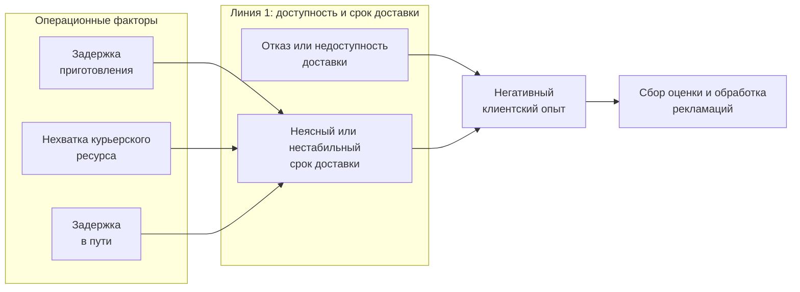

# Этап 6. VAD / Process Landscape цифрового контура доставки Dodo Pizza

## 3.2. Модель процессов верхнего уровня

### Аргументация выбора нотации VAD

Для верхнего уровня моделирования в проекте используется VAD / Process Landscape, поскольку эта нотация позволяет показать цифровой контур доставки как цепочку крупных процессов, создающих ценность для клиента. В отличие от BPMN, VAD не описывает пошаговое выполнение процесса, роли, события и развилки, а фиксирует границы процессной области и место выбранных для детализации блоков. Поэтому VAD используется как первый уровень иерархии моделей: от общей карты процессов проект переходит к SIPOC и далее к BPMN AS IS / TO BE для выбранных процессов.

---

## Рисунок 3.1. VAD / Process Landscape цифрового контура доставки Dodo Pizza

> VAD показывает карту процессов верхнего уровня. Это не BPMN, не дерево проблем и не TO BE-модель.  
> Синим выделен процесс, который далее детализируется в полном BPMN AS IS / TO BE.  
> Жёлтым выделен связанный процесс, для которого строится упрощённая TO BE-модель.

<svg width="100%" viewBox="0 0 1500 850" xmlns="http://www.w3.org/2000/svg">

  <!-- Общая рамка -->
  <rect x="20" y="20" width="1460" height="810"
        fill="#ffffff" stroke="#222222" stroke-width="1.5"/>

  <!-- ===== Верхний блок ===== -->
  <text x="750" y="58" text-anchor="middle"
        font-family="Arial, sans-serif" font-size="26" font-weight="700" fill="#111111">
    Процессы управления и развития
  </text>

  <rect x="70" y="75" width="1360" height="190" rx="28" ry="28"
        fill="#ffffff" stroke="#222222" stroke-width="2"/>

  <!-- Стратегия -->
  <g transform="translate(155,135)">
    <polygon points="0,0 255,0 280,55 255,110 0,110 22,55"
             fill="#49a64f" stroke="#49a64f" stroke-width="2"/>
    <text x="150" y="48" text-anchor="middle"
          font-family="Arial, sans-serif" font-size="18" font-weight="600" fill="#ffffff">
      Управление
    </text>
    <text x="150" y="75" text-anchor="middle"
          font-family="Arial, sans-serif" font-size="18" font-weight="600" fill="#ffffff">
      развитием сервиса
    </text>
    <text x="44" y="72" text-anchor="middle"
          font-family="Arial, sans-serif" font-size="34" font-weight="700" fill="#ffffff">»</text>
  </g>

  <!-- Качество -->
  <g transform="translate(465,135)">
    <polygon points="0,0 255,0 280,55 255,110 0,110 22,55"
             fill="#49a64f" stroke="#49a64f" stroke-width="2"/>
    <text x="150" y="48" text-anchor="middle"
          font-family="Arial, sans-serif" font-size="18" font-weight="600" fill="#ffffff">
      Контроль качества
    </text>
    <text x="150" y="75" text-anchor="middle"
          font-family="Arial, sans-serif" font-size="18" font-weight="600" fill="#ffffff">
      доставки
    </text>
    <text x="44" y="72" text-anchor="middle"
          font-family="Arial, sans-serif" font-size="34" font-weight="700" fill="#ffffff">»</text>
  </g>

  <!-- Dodo IS -->
  <g transform="translate(775,135)">
    <polygon points="0,0 255,0 280,55 255,110 0,110 22,55"
             fill="#49a64f" stroke="#49a64f" stroke-width="2"/>
    <text x="150" y="48" text-anchor="middle"
          font-family="Arial, sans-serif" font-size="18" font-weight="600" fill="#ffffff">
      Развитие приложения
    </text>
    <text x="150" y="75" text-anchor="middle"
          font-family="Arial, sans-serif" font-size="18" font-weight="600" fill="#ffffff">
      и Dodo IS
    </text>
    <text x="44" y="72" text-anchor="middle"
          font-family="Arial, sans-serif" font-size="34" font-weight="700" fill="#ffffff">»</text>
  </g>

  <!-- Отзывы -->
  <g transform="translate(1085,135)">
    <polygon points="0,0 255,0 280,55 255,110 0,110 22,55"
             fill="#49a64f" stroke="#49a64f" stroke-width="2"/>
    <text x="150" y="48" text-anchor="middle"
          font-family="Arial, sans-serif" font-size="18" font-weight="600" fill="#ffffff">
      Анализ отзывов
    </text>
    <text x="150" y="75" text-anchor="middle"
          font-family="Arial, sans-serif" font-size="18" font-weight="600" fill="#ffffff">
      клиентов
    </text>
    <text x="44" y="72" text-anchor="middle"
          font-family="Arial, sans-serif" font-size="34" font-weight="700" fill="#ffffff">»</text>
  </g>

  <text x="750" y="248" text-anchor="middle"
        font-family="Arial, sans-serif" font-size="14" fill="#555555">
  </text>

  <!-- ===== Основные процессы ===== -->
  <text x="750" y="315" text-anchor="middle"
        font-family="Arial, sans-serif" font-size="26" font-weight="700" fill="#111111">
    Основные процессы
  </text>

  <rect x="70" y="335" width="1360" height="210" rx="28" ry="28"
        fill="#ffffff" stroke="#222222" stroke-width="2"/>

  <!-- Оформление заказа -->
  <g transform="translate(135,400)">
    <polygon points="0,0 255,0 280,55 255,110 0,110 22,55"
             fill="#49a64f" stroke="#49a64f" stroke-width="2"/>
    <text x="150" y="38" text-anchor="middle"
          font-family="Arial, sans-serif" font-size="18" font-weight="600" fill="#ffffff">
      Оформление заказа
    </text>
    <text x="150" y="65" text-anchor="middle"
          font-family="Arial, sans-serif" font-size="18" font-weight="600" fill="#ffffff">
      в приложении
    </text>
    <text x="150" y="92" text-anchor="middle"
          font-family="Arial, sans-serif" font-size="18" font-weight="600" fill="#ffffff">
      или на сайте
    </text>
    <text x="44" y="72" text-anchor="middle"
          font-family="Arial, sans-serif" font-size="34" font-weight="700" fill="#ffffff">»</text>
  </g>

  <!-- ETA -->
  <g transform="translate(455,400)">
    <polygon points="0,0 285,0 310,55 285,110 0,110 22,55"
             fill="#49a64f" stroke="#1a73e8" stroke-width="6"/>
    <text x="165" y="48" text-anchor="middle"
          font-family="Arial, sans-serif" font-size="18" font-weight="600" fill="#ffffff">
      Расчёт и сопровождение
    </text>
    <text x="165" y="75" text-anchor="middle"
          font-family="Arial, sans-serif" font-size="18" font-weight="600" fill="#ffffff">
      срока доставки
    </text>
    <text x="44" y="72" text-anchor="middle"
          font-family="Arial, sans-serif" font-size="34" font-weight="700" fill="#ffffff">»</text>
  </g>

  <!-- Доставка -->
  <g transform="translate(815,400)">
    <polygon points="0,0 255,0 280,55 255,110 0,110 22,55"
             fill="#49a64f" stroke="#49a64f" stroke-width="2"/>
    <text x="150" y="48" text-anchor="middle"
          font-family="Arial, sans-serif" font-size="18" font-weight="600" fill="#ffffff">
      Доставка заказа
    </text>
    <text x="150" y="75" text-anchor="middle"
          font-family="Arial, sans-serif" font-size="18" font-weight="600" fill="#ffffff">
      клиенту
    </text>
    <text x="44" y="72" text-anchor="middle"
          font-family="Arial, sans-serif" font-size="34" font-weight="700" fill="#ffffff">»</text>
  </g>

  <!-- Жалобы -->
  <g transform="translate(1135,400)">
    <polygon points="0,0 275,0 300,55 275,110 0,110 22,55"
             fill="#49a64f" stroke="#f9ab00" stroke-width="6"/>
    <text x="160" y="37" text-anchor="middle"
          font-family="Arial, sans-serif" font-size="17" font-weight="600" fill="#ffffff">
      Сбор оценки
    </text>
    <text x="160" y="64" text-anchor="middle"
          font-family="Arial, sans-serif" font-size="17" font-weight="600" fill="#ffffff">
      и обработка жалобы
    </text>
    <text x="160" y="91" text-anchor="middle"
          font-family="Arial, sans-serif" font-size="17" font-weight="600" fill="#ffffff">
      клиента
    </text>
    <text x="44" y="72" text-anchor="middle"
          font-family="Arial, sans-serif" font-size="34" font-weight="700" fill="#ffffff">»</text>
  </g>

  <!-- ===== Обеспечивающие процессы ===== -->
  <text x="750" y="600" text-anchor="middle"
        font-family="Arial, sans-serif" font-size="26" font-weight="700" fill="#111111">
    Операционные обеспечивающие процессы
  </text>

  <rect x="70" y="620" width="1360" height="180" rx="28" ry="28"
        fill="#ffffff" stroke="#222222" stroke-width="2"/>

  <!-- Проверка адреса -->
  <g transform="translate(210,665)">
    <polygon points="0,0 310,0 335,55 310,110 0,110 22,55"
             fill="#49a64f" stroke="#49a64f" stroke-width="2"/>
    <text x="180" y="35" text-anchor="middle"
          font-family="Arial, sans-serif" font-size="17" font-weight="600" fill="#ffffff">
      Проверка адреса
    </text>
    <text x="180" y="62" text-anchor="middle"
          font-family="Arial, sans-serif" font-size="17" font-weight="600" fill="#ffffff">
      и доступности
    </text>
    <text x="180" y="89" text-anchor="middle"
          font-family="Arial, sans-serif" font-size="17" font-weight="600" fill="#ffffff">
      доставки
    </text>
    <text x="44" y="72" text-anchor="middle"
          font-family="Arial, sans-serif" font-size="34" font-weight="700" fill="#ffffff">»</text>
  </g>

  <!-- Приготовление -->
  <g transform="translate(595,665)">
    <polygon points="0,0 250,0 275,55 250,110 0,110 22,55"
             fill="#49a64f" stroke="#49a64f" stroke-width="2"/>
    <text x="150" y="50" text-anchor="middle"
          font-family="Arial, sans-serif" font-size="18" font-weight="600" fill="#ffffff">
      Приготовление
    </text>
    <text x="150" y="77" text-anchor="middle"
          font-family="Arial, sans-serif" font-size="18" font-weight="600" fill="#ffffff">
      заказа
    </text>
    <text x="44" y="72" text-anchor="middle"
          font-family="Arial, sans-serif" font-size="34" font-weight="700" fill="#ffffff">»</text>
  </g>

  <!-- Курьер и маршрут -->
  <g transform="translate(920,665)">
    <polygon points="0,0 310,0 335,55 310,110 0,110 22,55"
             fill="#49a64f" stroke="#49a64f" stroke-width="2"/>
    <text x="180" y="50" text-anchor="middle"
          font-family="Arial, sans-serif" font-size="18" font-weight="600" fill="#ffffff">
      Назначение курьера
    </text>
    <text x="180" y="77" text-anchor="middle"
          font-family="Arial, sans-serif" font-size="18" font-weight="600" fill="#ffffff">
      и маршрутизация
    </text>
    <text x="44" y="72" text-anchor="middle"
          font-family="Arial, sans-serif" font-size="34" font-weight="700" fill="#ffffff">»</text>
  </g>

</svg>

### Финальная версия названий

**Процессы управления и развития:**

1. Управление развитием сервиса
2. Контроль качества доставки
3. Развитие приложения и Dodo IS
4. Анализ клиентского опыта

**Основные процессы:**

1. Оформление заказа в приложении или на сайте
2. **Расчёт и сопровождение срока доставки**
3. Доставка заказа клиенту
4. **Сбор оценки и обработка рекламаций**

**Операционные обеспечивающие процессы:**

1. Проверка адреса и доступности доставки
2. Приготовление заказа
3. **Назначение доставки и маршрутизация** 
### Пояснение к рисунку 3.1

Рисунок 3.1 представляет VAD / Process Landscape цифрового контура доставки Dodo Pizza. Диаграмма построена по принципу карты процессов верхнего уровня: сверху показаны процессы управления и развития, в центре — основные процессы, формирующие клиентскую ценность, снизу — операционные обеспечивающие процессы.

В центре схемы расположена основная цепочка цифрового клиентского пути: от управления цифровым заказом до доставки, информирования клиента и последующей оценки или рекламации. Процесс «Расчёт и сопровождение срока доставки» выделен синим цветом, поскольку он выбран для дальнейшей детализации в BPMN AS IS и BPMN TO BE. Процесс «Сбор оценки и обработка рекламаций» выделен жёлтым цветом как связанная вторая линия проекта, для которой строится упрощённая TO BE-модель.

Операционные обеспечивающие процессы вынесены в отдельный нижний слой, поскольку они поддерживают выполнение основной цепочки, но не являются самостоятельной клиентской ценностью на уровне VAD. К ним относятся проверка адреса, зоны доставки и доступности, приготовление заказа, а также назначение доставки и маршрутизация.

Процессы управления и развития показаны как контекст и не детализируются в дальнейшем моделировании. Это связано с границами проекта: работа рассматривает цифровой клиентский контур доставки и рекламаций, а не всю систему стратегического управления, финансов, маркетинга, HR или развития компании. Поэтому такие процессы отражены на VAD для соответствия логике process landscape, но остаются вне границ BPMN-моделирования.

Важно, что VAD не содержит TO BE-решений: альтернативной пиццерии, динамического пересчёта ETA, push-уведомлений, ИИ-triage или policy matrix. Эти элементы относятся к уровню BPMN TO BE и будут показаны только внутри детализированных моделей процессов P3 и P7.

---

## Рисунок 3.2. Схема связи двух диагностических линий

> Эта схема не является частью VAD. Она поясняет логику связи диагностики главы 2: сбой доступности или срока доставки формирует негативный клиентский опыт и может привести к рекламации.

### Пояснение к рисунку 3.2

Рисунок 3.2 показывает не процессную архитектуру, а связь двух проблемных линий, выявленных в диагностике главы 2. Если клиент сталкивается с отказом, недоступностью доставки, неясным сроком или фактической задержкой, это ухудшает клиентский опыт. После этого проблема может перейти в блок P7 — сбор оценки и обработку рекламаций.

Эта схема нужна для пояснения сюжета курсовой: первая линия связана с доступностью и сроком доставки, а вторая — с последствиями проблемного заказа в канале поддержки. При этом сама VAD-диаграмма остаётся нейтральной картой процессов и не превращается в дерево проблем или TO BE-модель.
## Текст для §3.2 главы 3

VAD / Process Landscape используется в данной работе как модель верхнего уровня, которая показывает цифровой контур доставки Dodo Pizza от оформления заказа до оценки клиентского опыта и возможной рекламации. Такая модель нужна для того, чтобы не начинать анализ сразу с BPMN и не смешивать разные уровни детализации. На VAD фиксируются только крупные процессы, а не отдельные действия пользователя, системы, пиццерии, курьера или оператора поддержки.

Граница модели ограничена цифровым клиентским контуром доставки: оформление заказа в приложении или на сайте, проверка доступности доставки, расчёт и сопровождение срока, приготовление, назначение доставки, информирование клиента, сбор оценки и обработка рекламации. За пределами VAD остаются маркетинг, HR, финансы, закупки, детальная кухня, складские операции и внутренние управленческие регламенты Dodo. Такое ограничение необходимо, поскольку задача проекта связана не со всей организацией Dodo Brands, а с клиентским опытом доставки и двумя связанными проблемными линиями: доступностью / сроком доставки и рекламациями.

На схеме выделены две группы процессов: основные и операционные обеспечивающие. К основным отнесены процессы, которые непосредственно формируют ценность для клиента в цифровом пути: управление цифровым заказом, расчёт и сопровождение срока доставки, доставка и информирование клиента о статусе, сбор оценки и обработка рекламаций. К обеспечивающим отнесены процессы, которые поддерживают выполнение основной цепочки: проверка адреса, зоны доставки и доступности, приготовление заказа, назначение доставки и маршрутизация. Такое разделение позволяет сохранить единую цепочку P1–P7, но одновременно показать, что часть процессов обеспечивает выполнение клиентского сценария, а не является самостоятельной ценностью для клиента.

Особое внимание в модели уделяется процессу «Расчёт и сопровождение срока доставки». Он выделяется как главный объект последующей BPMN-детализации, поскольку именно в нём концентрируется первая проблемная линия проекта: неясный или нестабильный срок, риск задержки, поздняя коммуникация и потеря управляемости ожидания клиента. Процесс «Сбор оценки и обработка рекламаций» также выделен, но детализируется упрощённо, поскольку он является второй связанной линией проекта: сбой в доставке повышает вероятность негативной оценки или обращения в поддержку.

После построения VAD проект переходит к более детальным моделям. Для выбранных процессов формируется SIPOC, где уточняются поставщики, входы, границы процесса, выходы и потребители результата. Далее для процесса P3 строятся BPMN AS IS и BPMN TO BE, а для P7 — упрощённая TO BE-модель. Таким образом, VAD не заменяет BPMN, а задаёт верхний уровень иерархии: сначала определяется место процесса в общем контуре, затем уточняются его границы, и только после этого описывается логика выполнения.

Управляющие и развивающие процессы сознательно не включаются в рисунок 3.1. К ним могли бы относиться стратегическое управление сетью, контроль качества, развитие Dodo IS, аналитика клиентского опыта и управление операционными KPI. Однако в рамках данной курсовой эти процессы не моделируются, поскольку они требуют доступа к внутренним регламентам и управленческим данным компании. В работе они рассматриваются как внешний контекст и ограничения, а не как самостоятельные блоки VAD.

---

## Таблица 3.1. Реестр процессов VAD

| Код | Название                                     | Группа         | Суть                                                                                                                                                                                          | Вход                                                                                      | Выход                                                                        | Детализация                                                     |
| --- | -------------------------------------------- | -------------- | --------------------------------------------------------------------------------------------------------------------------------------------------------------------------------------------- | ----------------------------------------------------------------------------------------- | ---------------------------------------------------------------------------- | --------------------------------------------------------------- |
| P1  | Управление цифровым заказом                  | Основной       | Процесс охватывает клиентское оформление заказа в цифровом канале: выбор товаров, формирование корзины и переход к доставке. На верхнем уровне это старт клиентского пути в контуре доставки. | Запрос клиента, корзина, выбранный канал, данные профиля                                  | Сформированный заказ для проверки возможности доставки                       | SIPOC как часть общего контура; в BPMN детально не раскрывается |
| P2  | Проверка адреса, зоны доставки и доступности | Обеспечивающий | Процесс определяет, может ли заказ быть доставлен по указанному адресу и доступна ли доставка в текущих условиях. В проекте этот блок связан с риском отказа или недоступности заказа.        | Адрес клиента, зона доставки, параметры заказа, текущая доступность точки                 | Подтверждение доступности или отказ / ограничение доставки                   | Учитывается в SIPOC P3; отдельный BPMN не строится              |
| P3  | Расчёт и сопровождение срока доставки        | Основной       | Процесс связан с определением и сопровождением клиентского срока доставки. Именно здесь в проекте концентрируются вопросы ETA/SLA, риска задержки и понятности ожидания для клиента.          | Данные заказа, доступность точки, загрузка кухни, доступность курьеров, статус выполнения | Заказ с рассчитанным / сопровождаемым сроком доставки и статусом для клиента | SIPOC; полный BPMN AS IS; полный BPMN TO BE                     |
| P4  | Приготовление заказа                         | Обеспечивающий | Процесс отражает операционное изготовление заказа в пиццерии. На VAD он показан только как крупный обеспечивающий блок без детализации кухни, рецептур и внутренних операций.                 | Принятый заказ, производственная очередь, ресурсы кухни                                   | Готовый заказ для передачи в доставку                                        | В BPMN не детализируется; учитывается как фактор срока          |
| P5  | Назначение доставки и маршрутизация          | Обеспечивающий | Процесс обеспечивает назначение курьерского ресурса и выбор маршрута доставки. В контексте проекта он влияет на реалистичность срока и риск задержки.                                         | Готовый или готовящийся заказ, доступность курьеров, адрес, дорожные условия              | Назначенная доставка и маршрут                                               | В BPMN не детализируется; учитывается как фактор P3             |
| P6  | Доставка и информирование клиента о статусе  | Основной       | Процесс охватывает физическую доставку заказа клиенту и передачу клиенту информации о статусе выполнения. На уровне VAD это финальная часть основной ценности доставки.                       | Заказ, маршрут, назначенный курьер, статусы выполнения                                    | Доставленный заказ и обновлённый клиентский статус                           | Связан с P3 и P7; отдельный BPMN не строится                    |
| P7  | Сбор оценки и обработка рекламаций           | Основной       | Процесс начинается после получения клиентом заказа или возникновения проблемного опыта. Он включает сбор обратной связи и обработку жалобы по проблемному заказу.                             | Оценка клиента, жалоба, данные заказа, история статусов                                   | Ответ клиенту, решение по обращению, данные для анализа качества             | SIPOC; упрощённая BPMN TO BE / упрощённая TO BE-модель          |

---

## Таблица 3.2. Иерархия моделей проекта

| Уровень | Нотация                                 | Объект                                        | Статус                                                                                    |
| ------- | --------------------------------------- | --------------------------------------------- | ----------------------------------------------------------------------------------------- |
| 1       | VAD / Process Landscape                 | 7 процессов цифрового контура доставки: P1–P7 | Строится в §3.2 как модель верхнего уровня                                                |
| 2       | SIPOC                                   | P3 «Расчёт и сопровождение срока доставки»    | Используется для фиксации границ перед BPMN                                               |
| 2       | SIPOC                                   | P7 «Сбор оценки и обработка рекламаций»       | Используется для фиксации границ упрощённой модели                                        |
| 3       | BPMN 2.0 AS IS                          | P3 «Расчёт и сопровождение срока доставки»    | Основная детальная модель текущего состояния, реконструкция по открытым данным и эмпирике |
| 4       | BPMN 2.0 TO BE                          | P3 «Расчёт и сопровождение срока доставки»    | Основная целевая модель с улучшениями внутри процесса                                     |
| 4       | Упрощённая TO BE-модель / BPMN-фрагмент | P7 «Сбор оценки и обработка рекламаций»       | Связанная модель второй проблемной линии                                                  |
| 5       | Глоссарий                               | Термины VAD, SIPOC и BPMN                     | Используется для единообразия терминов и защиты модели                                    |

---

## Таблица 3.3. Соглашение о моделировании

| Нотация                           | Зачем используется                                                                          | Где в отчёте                  | Ограничения                                                                          |
| --------------------------------- | ------------------------------------------------------------------------------------------- | ----------------------------- | ------------------------------------------------------------------------------------ |
| VAD / Process Landscape           | Показывает процессы верхнего уровня и место выбранных процессов в цифровом контуре доставки | §3.2, рисунок 3.1             | Не показывает роли, события, gateway, исключения и TO BE-фичи                        |
| Схема связи диагностических линий | Поясняет, как сбой доступности / ETA связан с негативным опытом и рекламацией               | §3.2, рисунок 3.2             | Не является частью VAD и не описывает процессную архитектуру                         |
| SIPOC                             | Фиксирует границы процесса, входы, выходы, поставщиков и потребителей                       | Перед BPMN-моделями P3 и P7   | Не показывает последовательность действий и развилки                                 |
| BPMN 2.0 AS IS                    | Детализирует реконструированный текущий процесс P3                                          | §3.4                          | Не должен выдавать непубличные внутренние регламенты Dodo за факт                    |
| BPMN 2.0 TO BE                    | Показывает целевое изменение процесса P3                                                    | §3.6                          | Улучшения являются проектными предложениями, а не утверждением о текущей работе Dodo |
| Упрощённая TO BE-модель P7        | Показывает целевую логику обработки рекламаций без равного по объёму второго BPMN           | §3.6 или приложение к главе 3 | Не заменяет полный BPMN P3 и не детализирует весь contact center                     |

---

## Краткий глоссарий VAD

| Термин                  | Определение в проекте                                                                                                                |
| ----------------------- | ------------------------------------------------------------------------------------------------------------------------------------ |
| VAD / Process Landscape | Диаграмма процессов верхнего уровня, показывающая крупные блоки цифрового контура доставки и связи между ними.                       |
| Основной процесс        | Процесс, который непосредственно участвует в создании ценности для клиента в цепочке доставки.                                       |
| Обеспечивающий процесс  | Процесс, который поддерживает выполнение основной цепочки, но сам по себе не является главным клиентским результатом.                |
| Цифровой заказ          | Заказ, оформленный клиентом через приложение или сайт.                                                                               |
| Доступность доставки    | Возможность выполнить заказ по указанному адресу и в текущих операционных условиях.                                                  |
| Срок доставки / ETA     | Ожидаемое время выполнения доставки, которое клиент использует для принятия решения о заказе и ожидании.                             |
| Маршрутизация           | Назначение доставки и выбор логики перемещения заказа к клиенту.                                                                     |
| Рекламация              | Обращение клиента по поводу проблемного заказа, например задержки, холодной еды, ошибки в составе или неудовлетворительного сервиса. |
| SIPOC                   | Табличная модель границ процесса: Supplier, Input, Process, Output, Customer.                                                        |
| BPMN                    | Нотация для детального описания процесса с событиями, действиями, ролями, развилками и исключениями.                                 |

---

## Чеклист самопроверки VAD

* [ ] На VAD ровно 7 блоков, не больше и не меньше.
* [ ] Имена процессов оформлены как отглагольное существительное + объект и начинаются с заглавной буквы.
* [ ] Основные и обеспечивающие процессы разделены.
* [ ] На VAD нет TO BE-элементов: альтернативной пиццерии, push-уведомлений, ИИ-triage, policy matrix.
* [ ] На VAD нет Ishikawa, дерева проблем, симптомов и формулировок проблем из главы 2.
* [ ] P3 визуально выделен как главный процесс для полного BPMN.
* [ ] P7 визуально выделен как связанный процесс для упрощённой TO BE-модели.
* [ ] На VAD нет BPMN-шагов, gateway, дорожек, ролей и событий.
* [ ] В тексте есть переход от VAD к SIPOC и BPMN.
* [ ] Управляющие и развивающие процессы объяснены как out of scope.
* [ ] Связь P3 → P7 показана на отдельной схеме, а не внутри VAD.
* [ ] Карта процессов выглядит нейтрально и не создаёт впечатление TO BE-модели.
