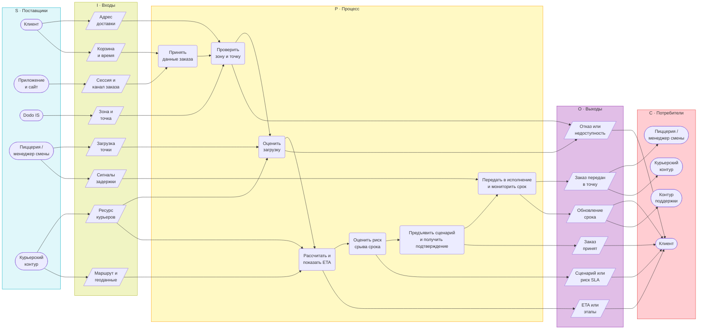
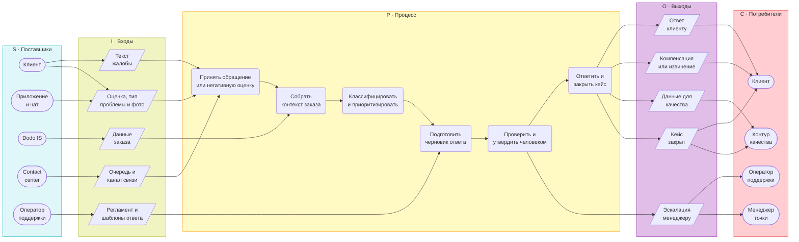
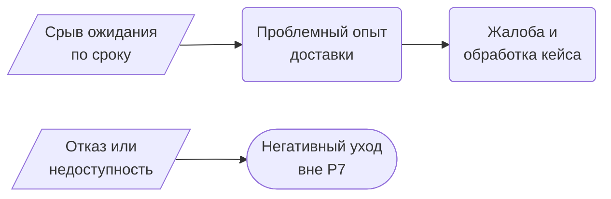

# Визуальный SIPOC для этапа 7

## Готовое содержимое файла

---
tags:
  - курсовая/моделирование
  - модели/sipoc
  - курсовая/глава3
created: 2026-06-10
status: черновик
version: v3
object: Dodo Pizza
aliases:
  - SIPOC
  - Границы процессов
  - SIPOC P3 P7
---

# SIPOC и границы процессов — P3 и P7

> [!abstract] Назначение
> Этап 7 фиксирует границы двух процессов **до** BPMN: кто даёт входы, какие данные входят в процесс, какой результат возникает и кто его получает.  
> **P3** — главный процесс проекта, для него далее строится полный BPMN AS IS / TO BE. **P7** — связанный второй процесс, для которого далее строится более компактная TO BE-модель.  
> См. также: [[process_landscape]] · [[03_РАНЖИРОВАНИЕ]] · [[assumptions_register]] · [[01_РАМКА_ПРОЕКТА]] · [[07_ПЛАН_РАБОТЫ]]

## 1. SIPOC в иерархии моделей

| Уровень | Нотация | Артефакт проекта | Вопрос |
|---|---|---|---|
| 1 | Process Landscape / VAD | [[process_landscape]] | Какие крупные процессы образуют цифровой контур доставки |
| 2 | SIPOC | этот файл | Где начинаются и заканчиваются P3 и P7, какие у них поставщики, входы, выходы и потребители |
| 3 | BPMN 2.0 | этап 8–10 | Кто и что делает внутри процесса, в какой последовательности и при каких условиях |
| 4 | Глоссарий | [[BPMN_глоссарий_шаблон]] | Как интерпретировать используемые элементы моделирования |

> [!tip] Методическая логика
> SIPOC в этой работе нужен как промежуточный уровень между landscape и BPMN.  
> Здесь показываются **границы и верхнеуровневая логика**, но не рисуются gateway, дорожки, message flow и подпроцессы.

> [!note] Правило колонок S и I (методичка, §2.4)
> **Поставщик (S)** — роль, подразделение, система или внешний контур, *кто* передаёт данные в процесс (ключевые поставщики процесса).  
> **Вход (I)** — документ, информация или сигнал, *что* передаётся (вход процесса обеспечивает начало преобразования).  
> **Потребитель (C)** — роль или контур, *кто* использует выход; по методичке потребителем может быть и другой процесс, но на диаграмме указываем **роль/подразделение**, а не код landscape.  
> Не смешивать уровни: «заказ», «жалоба», «ETA» — это **входы или выходы**, а не поставщики; «Dodo IS», «пиццерия», «contact center» — **поставщики**.

## 2. P3 — визуальная SIPOC процесса доступности и срока доставки

### 2.1. Идентификация процесса

| | |
|---|---|
| **Код на landscape** | P3 · Расчёт и сопровождение срока доставки |
| **Рабочее название для BPMN** | Обработка заказа на доставку при риске недоступности или срыва срока доставки |
| **Роль в проекте** | Главный процесс для полного BPMN AS IS / TO BE |
| **Связь с соседними блоками** | Вход из **P1** и **P2**; выход в **P4–P6**; при срыве ожиданий возможен переход в **P7** |

### 2.2. Визуальная SIPOC-диаграмма P3

**Легенда форм:**  
`([…])` — поставщик или потребитель (роль / контур); `[/…/]` — вход или выход (данные / сигнал); `(…)` — верхнеуровневый шаг процесса.

> **Триггер:** клиент оформляет заказ на доставку. **Финиш:** заказ принят с ETA / отказ до оплаты. **Граница P3–P6:** шаг 7 — только верхний мониторинг срока; детальный статус «в пути» — в P6. **AS IS** — реконструкция ([[assumptions_register]]).

### 2.3. Таблица SIPOC P3

| Supplier | Input | Process | Output | Customer |
|---|---|---|---|---|
| Клиент | Адрес доставки; корзина; время заказа | 1. Принять данные заказа | ETA или этапы | Клиент |
| Приложение и сайт | Сессия и канал заказа; UI-выбор доставки | 2. Проверить зону и точку | Сценарий или риск SLA | Клиент |
| Dodo IS | Данные о зоне доставки; назначение точки; параметры расчёта ETA | 3. Оценить загрузку точки и ресурс курьеров | Заказ принят | Клиент |
| Пиццерия / менеджер смены | Фактическая загрузка точки; сигналы задержки исполнения | 4. Рассчитать и показать ETA | Заказ передан в точку | Пиццерия / менеджер смены; курьерский контур |
| Курьерский контур | Доступность курьеров; маршрут и геоданные | 5. Оценить риск срыва срока | Отказ или недоступность | Клиент |
|  |  | 6. Предъявить сценарий и получить подтверждение | Обновление срока | Клиент; контур поддержки |
|  |  | 7. Передать в исполнение и мониторить срок |  |  |

### 2.4. Триггер, финиш и границы P3

| Элемент | Формулировка |
|---|---|
| **Триггер** | Клиент инициирует оформление заказа на доставку: указан адрес, собрана корзина, выбран канал «доставка» |
| **Финиш — успех** | Заказ принят и передан в исполнение с понятным для клиента сроком или статусом |
| **Финиш — отказ** | Клиент получает отказ / недоступность или не завершает оформление до оплаты |
| **Промежуточный исход** | После принятия заказа срок доставки меняется и клиент получает обновление срока или статуса |

| In scope | Out of scope |
|---|---|
| Проверка адреса и зоны доставки на стыке с P2 | Детальная кухня, рецептуры и станции |
| Проверка доступности точки и ресурса исполнения | Маркетинг, акции и лояльность |
| Расчёт и показ ETA или статусов | Полный платёжный контур, кроме отказа до оплаты |
| Подтверждение заказа и передача в исполнение | HR, закупки и франчайзинговые отношения |
| Верхнеуровневый мониторинг изменения срока (шаг 7; детальный статус «в пути» — P6) | Детальная маршрутизация «по улицам» |

### 2.5. Дорожки BPMN для этапа 8

| Участник | Дорожка BPMN | Роль |
|---|---|---|
| Клиент | Клиент | Вводит данные заказа, видит ETA или отказ, подтверждает или прекращает оформление |
| Приложение и сайт | Цифровой канал | Показывает ETA, статусы и сообщения клиенту |
| Dodo IS | Dodo IS / алгоритм ETA | Проверяет зону, точку, рассчитывает ETA и отслеживает изменение срока |
| Пиццерия | Пиццерия / менеджер смены | Подтверждает приём заказа, сигнализирует о перегрузе или задержке |
| Курьерский контур | Доставка / курьеры | Влияет на фактический срок и даёт события для обновления ожидания |

### 2.6. Эмпирика и допущения P3

| Основание | Что фиксируем |
|---|---|
| **Опрос** | 41,6% сталкивались с задержкой; 23,4% — с отказом или недоступностью; 32,5% — с непонятным временем доставки; 57,1% готовы к другой точке при честном ETA |
| **Коды отзывов** | `задержка`, `ETA_несовпадение`, `ETA_неясен`, `отказ_недоступность`, `нет_уведомления`, `альтернативная_точка` |
| **Реконструкция AS IS** | Точные правила customer-facing ETA и поведение системы при перегрузе точки публично не раскрыты |
| **TO BE не рисуется как факт** | Альтернативная пиццерия и проактивный push остаются предложениями для BPMN TO BE, а не существующими шагами AS IS |
| **Ветка B** | Курьер соседней точки не включается в визуальный SIPOC как действующий элемент процесса |
| **Поставщики** | В колонке S — только роли и контуры; геоданные и маршрут — вход от курьерского контура, не отдельный «процесс landscape» |

> [!warning] Граница интерпретации
> Термин **SLA** в проекте используется как аналитическая метка риска нарушения обещанного срока, а не как цитата из публичного регламента Dodo.

## 3. P7 — визуальная SIPOC процесса рекламаций

### 3.1. Идентификация процесса

| | |
|---|---|
| **Код на landscape** | P7 · Сбор оценки и обработка рекламаций |
| **Рабочее название** | Обработка клиентской рекламации по проблемному заказу |
| **Роль в проекте** | Связанная вторая линия; далее — упрощённая TO BE-модель |
| **Связь с соседними блоками** | Вход после P6 или из оценки заказа в приложении |

### 3.2. Визуальная SIPOC-диаграмма P7

**Легенда форм:**  
`([…])` — поставщик или потребитель (роль / контур); `[/…/]` — вход или выход (данные / сигнал); `(…)` — верхнеуровневый шаг процесса.

> **Триггер:** жалоба или оценка &lt; 5. **Финиш:** кейс закрыт или эскалирован. **Human-in-the-loop:** клиентские выходы (ответ, компенсация) — только после шага 5. **ИИ-помощник и policy matrix** — TO BE, не рисуются как поставщик AS IS ([[assumptions_register]], п. 7–8).

### 3.3. Таблица SIPOC P7

| Supplier | Input | Process | Output | Customer |
|---|---|---|---|---|
| Клиент | Текст жалобы; оценка; тип проблемы; фото; комментарий | 1. Принять обращение или негативную оценку | Эскалация менеджеру | Оператор поддержки; менеджер точки |
| Приложение и чат | Канал подачи; медиа; история сообщений | 2. Собрать контекст заказа | Ответ клиенту | Клиент |
| Dodo IS | Номер заказа; состав; время; статус доставки | 3. Классифицировать и приоритизировать | Компенсация или извинение | Клиент |
| Contact center | Очередь обращения; канал связи | 4. Подготовить черновик ответа | Данные для качества | Контур качества |
| Оператор поддержки | Регламент; шаблоны ответа; правила эскалации | 5. Проверить и утвердить человеком | Кейс закрыт | Клиент; контур качества |
|  |  | 6. Ответить и закрыть кейс |  |  |

### 3.4. Триггер, финиш и границы P7

| Элемент | Формулировка |
|---|---|
| **Триггер** | Клиент инициирует жалобу или негативную обратную связь: оценка ниже 5, обращение в чат или в contact center |
| **Финиш — успех** | Клиент получает ответ и решение по кейсу; обращение закрыто (выход «Кейс закрыт») |
| **Финиш — эскалация** | Сложный кейс передан менеджеру точки или старшему оператору после проверки человеком |

| In scope | Out of scope |
|---|---|
| Приём жалобы и сбор контекста | Производство заказа и физическая доставка |
| Первичная классификация и triage | Полный BPMN контура P3–P6 |
| Подготовка ответа и эскалация | Автономные денежные решения ИИ |
| Закрытие кейса и передача данных в качество | Детальная кухня и маркетинг |

### 3.5. Эмпирика и допущения P7

| Основание | Что фиксируем |
|---|---|
| **Опрос** | 27,3% обращались в поддержку; 16,9% не обращались, но хотели; 81,0% среди обратившихся столкнулись с ботом или долгим ответом |
| **Коды отзывов** | `поддержка_непонятно`, `поддержка_долго`, `чат_оператор`, `компенсация`, `повторная_проблема` |
| **AS IS по открытым данным** | Виден сценарий «оценка <5 → типовая проблема → комментарий и фото → менеджер связывается в течение дня» |
| **TO BE не рисуется как факт** | ИИ-triage, policy matrix и human-in-the-loop остаются решениями целевого состояния, а не действующим регламентом |
| **Поставщики** | «Dodo IS» — поставщик; «данные заказа» — вход. Оператор — поставщик регламента, не дублирует contact center как «очередь» |
| **Граница процесса** | P7 моделируется компактнее, чем P3, чтобы не превращать проект в две равные BPMN-линии |

## 4. Стыковка P3 → P7

Короткая логика стыковки: отказ без альтернативы может завершиться негативным уходом ещё до линии рекламаций, а сорванное ожидание по уже принятому заказу даёт вход в P7 как в процесс обработки жалобы.

## 5. Чеклист этапа 7

| Проверка | Статус | Комментарий |
|---|:---:|---|
| Для P3 есть отдельная mermaid-SIPOC в формате S–I–P–O–C | ✅ | Диаграмма дана в §2.2 |
| Для P7 есть отдельная mermaid-SIPOC в формате S–I–P–O–C | ✅ | Диаграмма дана в §3.2 |
| Suppliers и Customers показаны овальными узлами | ✅ | Синтаксис `([…])` |
| Inputs и Outputs показаны параллелограммами | ✅ | Синтаксис `[/…/]` |
| Process показан вертикальной цепочкой шагов | ✅ | Синтаксис `(…)` и стрелки сверху вниз |
| Есть кросс-связи между колонками | ✅ | Связи S→I→P→O→C не сведены к одной вертикали |
| P3 и P7 не смешаны на одной SIPOC-диаграмме | ✅ | Отдельные блоки и отдельные ID |
| Mermaid совместим с Obsidian | ✅ | Использованы `flowchart LR`, `subgraph`, `direction TB`, `style` |
| TO BE не выдано за действующий AS IS | ✅ | Вынесено в примечания об ограничениях и последующие этапы |
| Поставщики отделены от входов (роли/контуры ≠ данные) | ✅ | Правило §1; исправлено «Dodo IS и заказ» → «Dodo IS» + вход «Данные заказа» |
| Клиентские выходы P7 — после проверки человеком | ✅ | Ответ и компенсация из шага 6, не из шага 4 |
| Содержание согласовано с landscape, эмпирикой и assumptions register | ✅ | Связки сведены в §§2–4 |

## 6. Текст для главы 3 §3.3

Для уточнения границ процессов перед построением BPMN в работе использована нотация SIPOC. Она позволяет зафиксировать поставщиков входов, входные данные, верхнеуровневую логику процесса, результаты и потребителей результата без избыточной детализации ролей, gateway и событий. В логике данной курсовой SIPOC занимает промежуточный уровень между Process Landscape и BPMN 2.0: сначала определяется место процесса в цифровом контуре доставки, затем уточняются его границы, после чего строится детальная модель выполнения.

Для основного процесса проекта — **P3 «Расчёт и сопровождение срока доставки»** — визуальная SIPOC показывает, что процесс начинается в момент, когда клиент уже сформировал заказ на доставку, а система получила адрес, корзину, сессию цифрового канала и справочные данные Dodo IS. В колонке поставщиков зафиксированы роли и контуры (клиент, приложение, Dodo IS, пиццерия, курьерский контур), а в колонке входов — передаваемые ими данные и сигналы, без смешения уровней «кто» и «что». В границы процесса включены проверка зоны и точки обслуживания, оценка загрузки, расчёт и показ ETA, оценка риска срыва срока, предъявление сценария клиенту, подтверждение заказа, передача в исполнение и верхнеуровневый мониторинг изменения срока. Результатом процесса выступают ETA или этапы, сценарий/оценка риска SLA, принятие заказа, передача в точку, отказ или недоступность, а также обновление срока после принятия. Такая граница соответствует проектной диагностике задержек, отказов и непонятного времени доставки.

Для связанного процесса **P7 «Сбор оценки и обработка рекламаций»** построена более компактная визуальная SIPOC. Она фиксирует, что процесс начинается после проблемного заказа или негативной оценки, включает приём обращения, сбор контекста, классификацию и приоритизацию кейса, подготовку черновика ответа, проверку и утверждение человеком, а затем — ответ клиенту и закрытие или эскалацию обращения. Клиентские результаты (ответ, компенсация) формируются только после human-in-the-loop; эскалация менеджеру выделяется отдельным выходом. Дополнительно фиксируются данные для контроля качества точки и статус закрытого кейса. Такое решение позволяет сохранить вторую проблемную линию в главе 3, но не превращать работу в две равные по объёму BPMN-модели.

Важно, что обе SIPOC-диаграммы не заменяют BPMN и не утверждают внутренние регламенты Dodo там, где публичного подтверждения нет. Для P3 элементы customer-facing ETA и реакция системы на перегруз точки трактуются как реконструкция AS IS по открытым данным и эмпирике, а альтернативная пиццерия и проактивные push-уведомления остаются решениями TO BE. Для P7 аналогично: ИИ-triage, policy matrix и human-in-the-loop относятся к целевому состоянию, а не описываются как действующая практика компании.

## 7. Переход к этапу 8

На этапе 8 SIPOC P3 переводится в BPMN AS IS.  
Из текущего файла в BPMN переходят:

1. старт и финиши процесса;
2. состав дорожек;
3. ключевые входы и выходы;
4. верхнеуровневая последовательность шагов;
5. границы in scope и out of scope;
6. ограничения по реконструкции AS IS из [[assumptions_register]].

Для P7 следующий шаг — не полный AS IS, а компактная TO BE-модель, которая опирается на зафиксированную границу процесса рекламации и на стык с P3 через негативный опыт доставки.

## Связанные заметки

- [[process_landscape]]
- [[03_РАНЖИРОВАНИЕ]]
- [[assumptions_register]]
- [[01_РАМКА_ПРОЕКТА]]
- [[07_ПЛАН_РАБОТЫ]]
