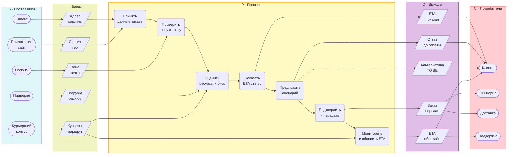
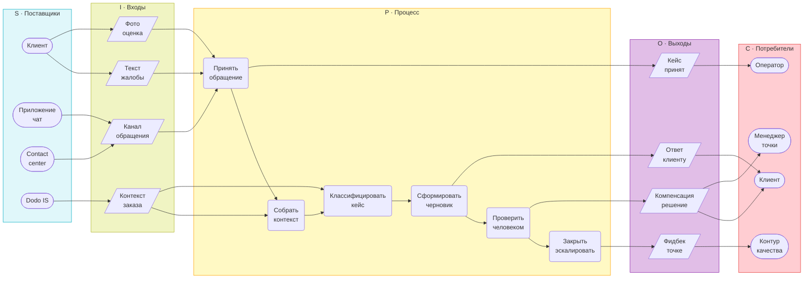

# Оценка VAD проекта Dodo Pizza и улучшения для визуального SIPOC в Obsidian Mermaid

## Executive summary

Текущий VAD проекта методически корректен как артефакт верхнего уровня: он показывает цифровой контур доставки, удерживает связь P1–P7, выделяет P3 как главный процесс для детального BPMN и P7 как связанную, но более компактную вторую линию, а также не смешивает верхнеуровневую карту с TO BE-фичами. В этом смысле проблема не в том, что VAD «плохой», а в том, что его нельзя использовать вместо визуального SIPOC этапа 7. fileciteturn0file8 fileciteturn0file6 fileciteturn0file9

Для этапа 7 главный разрыв находится не в содержании, а в форме. Содержательно черновик `sipoc_granitsy_protsessov.md` уже содержит почти всё нужное: триггеры, результаты, in scope / out of scope, дорожки BPMN, эмпирическое обоснование и допущения для P3 и P7. Но визуально это пока boundary-diagram + markdown-таблица, а не классический SIPOC в логике **S–I–P–O–C** с отдельными колонками, правильными формами узлов и кросс-связями между ними. fileciteturn0file5 fileciteturn0file9

Наиболее важные исправления такие: не пытаться «перекрасить» текущий VAD в SIPOC; собрать две отдельные Mermaid-диаграммы для **P3** и **P7**; сократить P3 до 5–7 макрошагов; вынести поставщиков, входы, выходы и потребителей в отдельные колонки; явно показать связи **Supplier → Input → Process → Output → Customer**; оставить TO BE-элементы только как пунктир или пометку, не как существующую AS IS-логику. Это полностью согласуется с рамкой проекта, реестром допущений, ранжированием и эмпирикой. fileciteturn0file0 fileciteturn0file4 fileciteturn0file1 fileciteturn0file7

## Источники и рамка оценки

В анализе использованы: `process_landscape.md` как канонический landscape P1–P7 и переход к SIPOC, `sipoc_granitsy_protsessov.md` как текущий носитель содержания SIPOC P3/P7, `assumptions_register.md` как источник ограничений факта/реконструкции/TO BE, `01_РАМКА_ПРОЕКТА.md` как источник предмета, границ и веток A/B/C, `03_РАНЖИРОВАНИЕ.md` как источник роли P3 и P7 в проекте, `опрос_агрегаты.md` как эмпирическое основание границ процессов. Дополнительно использованы `6 этап черн.md` для анализа текущего VAD-скриншота и `07_ПЛАН_РАБОТЫ.md` для проверки логики этапов 6–8 и ожидаемого состава SIPOC. fileciteturn0file6 fileciteturn0file5 fileciteturn0file4 fileciteturn0file0 fileciteturn0file1 fileciteturn0file7 fileciteturn0file8 fileciteturn0file9

Рамка проекта зафиксирована чётко: предмет исследования — два связанных процесса цифрового клиентского опыта в контуре доставки, а именно управление доступностью и сроком доставки и обработка клиентской рекламации; P3 — главный процесс для полного BPMN, P7 — упрощённая вторая модель. В scope входят Process Landscape, SIPOC и BPMN, а внутренние KPI и неподтверждённые регламенты Dodo сознательно исключены и переводятся либо в реконструкцию, либо в TO BE. fileciteturn0file0 fileciteturn0file1

Отдельно важно зафиксировать ограничение: я не могу подтвердить точные внутренние правила customer-facing ETA, детальную логику перегруза точки и фактические SLA контакт-центра Dodo. Сами материалы проекта относят это к реконструкции AS IS или к TO BE-гипотезам и требуют не выдавать такие вещи за публично подтверждённый факт. fileciteturn0file4 fileciteturn0file0

## Оценка текущего VAD относительно эталона SIPOC

Текущий VAD на скриншоте и в файле этапа 6 выполнен как карта процессов верхнего уровня: сверху показаны процессы управления и развития, в центре — основные процессы, снизу — операционные обеспечивающие процессы; P3 выделен синим, P7 — жёлтым. Это соответствует логике этапа 6, где VAD прямо определён как верхний уровень модели, а не как BPMN или TO BE. fileciteturn0file8 fileciteturn0file6

.png)

Дополнительный плюс текущего VAD в том, что он не тащит в верхний уровень будущие решения вроде альтернативной пиццерии, проактивного push или ИИ-помощника: эти элементы в проектных документах сознательно оставлены для TO BE внутри P3 и P7, а не для landscape. Сама логика «сначала Process Landscape, потом SIPOC, потом BPMN» также уже зафиксирована в плане и в текущем SIPOC-черновике. fileciteturn0file6 fileciteturn0file9 fileciteturn0file5

Но если сравнивать текущий VAD с эталоном этапа 7, несоответствие принципиальное. Скриншот не содержит пяти колонок S–I–P–O–C, не использует овалы для Suppliers/Customers, параллелограммы для Inputs/Outputs и вертикальную процессную цепочку внутри колонки P, не показывает кросс-связи между колонками и не разделяет P3 и P7 на две самостоятельные SIPOC-диаграммы; он лишь фиксирует место этих процессов в общей архитектуре. Это нормально для VAD и недостаточно для SIPOC. fileciteturn0file8 fileciteturn0file6

Ключевая методическая проблема сейчас даже шире, чем один только скриншот. В текущем `sipoc_granitsy_protsessov.md` есть содержательно полезные схемы, но они пока тоже не являются классическим визуальным SIPOC: P3 оформлен как `flowchart TB` с блоками `IN`, `P3SCOPE`, `OUT`, `OOS`, а P7 — как компактная flowchart-схема входа и внутреннего контура. Это хорошие промежуточные boundary-diagrams, но не финальный артефакт этапа 7 в требуемой форме. Кроме того, в них используются общие ID типа `S1`, `A1`, `START7`, а не префиксы `p3_` и `p7_`, и стиль применяется к одному subgraph, а не к пяти колонкам SIPOC. fileciteturn0file5

Ниже — сжатая оценка соответствия.

| Критерий | Текущее состояние | Вывод |
|---|---|---|
| Верхнеуровневая карта процессов | Есть | Для VAD соответствует |
| Выделение P3 и P7 как ключевых процессов | Есть | Для проекта соответствует |
| Разделение VAD и TO BE | Есть | Сильная сторона текущего VAD |
| Пять колонок S–I–P–O–C | Нет | Для этапа 7 не соответствует |
| Отдельная диаграмма P3 | Нет | Нужна новая SIPOC |
| Отдельная диаграмма P7 | Нет | Нужна новая SIPOC |
| Формы узлов по ролям | Нет | Нужна замена визуальной грамматики |
| Явные связи S→I→P→O→C | Нет | Нужны стрелки между колонками |
| Mermaid-код для Obsidian | Частично | Draft SIPOC уже в Mermaid, но не в нужной форме |
| Структурная готовность к наполнению | Высокая | Содержание уже собрано в черновике SIPOC |

Итоговая оценка такая: **как VAD текущая схема хороша; как SIPOC этапа 7 — не годится без полноценной переработки**. Правильная стратегия — сохранить VAD как артефакт этапа 6 и на его основе, но не вместо него, сделать две независимые Mermaid-SIPOC для P3 и P7. fileciteturn0file8 fileciteturn0file6 fileciteturn0file5

## Замечания по содержанию и группировке элементов

Самая важная содержательная недоработка текущего VAD — чрезмерная агрегация P3. На скриншоте центральный синий шеврон называется «Расчёт и показ срока доставки», но рамка проекта, `process_landscape.md`, план этапа 7 и сам SIPOC-черновик описывают более широкий процесс: не только показ ETA, но и проверку доступности, связь с точкой обслуживания, оценку ресурсов, риск срыва, выбор сценария, передачу заказа в исполнение и мониторинг/пересчёт срока. Поэтому для этапа 7 название P3 лучше нормализовать минимум до «Расчёт и сопровождение срока доставки», а в тексте BPMN — до полного рабочего названия «Обработка заказа на доставку при риске недоступности или срыва срока доставки». Иначе визуал обедняет сам предмет проекта. fileciteturn0file8 fileciteturn0file6 fileciteturn0file5 fileciteturn0file0 fileciteturn0file9

Для P3 в VAD отсутствуют почти все элементы, которые уже собраны в содержательной части SIPOC. В текущем черновике и плане для P3 перечислены поставщики и входы: клиент, приложение/сайт, Dodo IS, пиццерия, курьерский контур, а также адрес, корзина, время заказа, геолокация, зона/точка, загрузка, backlog, доступность курьеров и маршрутные данные. В VAD они не видны вообще, хотя именно они превращают общую «полосу процесса» в SIPOC с границами и ответственным содержанием. fileciteturn0file5 fileciteturn0file9

Ещё одна проблема P3 — число шагов. В черновике SIPOC их сейчас девять, а ваш эталон этапа 7 требует 5–7 шагов в колонке Process. Это не означает потерю логики; это означает, что P3 нужно свернуть до макроуровня. Лучшее сжатие здесь такое: объединить получение данных заказа с первичной проверкой зоны; объединить оценку ресурсов с оценкой риска; объединить подтверждение заказа с передачей в исполнение. Тогда процесс остаётся содержательным, но становится визуально читаемым и соответствует классическому SIPOC. fileciteturn0file5 fileciteturn0file9

У P3 также недоразвиты выходы как отдельные сущности. В черновике они перечислены текстом в одну строку, но для визуального SIPOC их надо разнести на отдельные output-узлы: `ETA показан`, `отказ до оплаты`, `альтернатива TO BE`, `заказ передан`, `ETA обновлён`. Это особенно важно потому, что один выход должен вести к нескольким потребителям: `заказ передан` нужен и пиццерии, и доставке; `ETA обновлён` нужен клиенту и при эскалации — контуру поддержки. fileciteturn0file5 fileciteturn0file0

Граница между P3 и P6 тоже требует аккуратной фиксации. На VAD статусная коммуникация вынесена в P6 («Доставка и информирование клиента о статусе»), но в черновике SIPOC P3 уже содержит `мониторинг и пересчёт ETA / уведомление при изменении`. Это не противоречие, но это место, где нужно быть последовательным: в SIPOC P3 оставить только то информирование, которое связано с управлением обещанием по сроку, а физическую доставку и общий финальный клиентский статус оставить нижестоящему P6. Иначе диаграмма либо станет слишком узкой, либо начнёт поглощать соседний процесс. fileciteturn0file6 fileciteturn0file5

Для P7 проблема обратная: в VAD он пока слишком общий и по названию, и по содержанию. Ранжирование, рамка проекта и SIPOC-черновик фиксируют, что P7 — это не просто «жалоба клиента», а процесс клиентской рекламации с triage, human-in-the-loop и, в TO BE, ИИ-помощником. Поэтому словарь лучше унифицировать как «обработка рекламаций», а в визуальном SIPOC показать реальные suppliers/inputs/outputs: клиент, приложение/чат, contact center, Dodo IS; текст жалобы, тип проблемы, комментарий, фото, оценка, контекст заказа; закрытый кейс, ответ клиенту, компенсация или эскалация, запись для улучшения точки. fileciteturn0file1 fileciteturn0file0 fileciteturn0file5

Отдельно стоит подчеркнуть, что P7 должен оставаться компактнее P3 не только потому, что так требует проект, но и потому, что это соответствует ранжированию: оба процесса набрали по 22 балла, но P3 выбран как более сильный объект для полного BPMN, а P7 — как связанная вторая линия, более защищаемая по открытым данным, но беднее по развилкам. Следовательно, в SIPOC это тоже должно читаться: P3 — подробнее и насыщеннее, P7 — короче и строже. fileciteturn0file1

Ниже — таблица преобразования VAD в SIPOC, которую стоит сохранить как рабочую в заметке или приложении.

| Элемент VAD | Куда в SIPOC попадает | Рекомендация |
|---|---|---|
| Управление развитием сервиса | Вне SIPOC | Не переносить в диаграмму этапа 7; оставить как контекст stage 6 |
| Контроль качества доставки | Вне SIPOC | В SIPOC не нужен, кроме текстовой ссылки на downstream-аналитику P7 |
| Развитие приложения и Dodo IS | Supplier | В P3 и P7 дать как поставщика системных данных |
| Анализ отзывов клиентов | Вне SIPOC | Не рисовать как узел S/I/O/C; при необходимости упомянуть после P7 как аналитический след |
| Оформление заказа в приложении или на сайте | Supplier + Input для P3 | Разложить на `Клиент`, `Приложение/сайт`, `Адрес`, `Корзина`, `Сессия/гео` |
| Расчёт и показ срока доставки | Process + Outputs для P3 | Переименовать в `Расчёт и сопровождение срока`; разделить на 5–7 шагов и 4–5 выходов |
| Доставка заказа клиенту | Downstream customer / adjacent process | Не тянуть внутрь P3; показать отдельной стыковкой P3→P6→P7 |
| Сбор оценки и обработка жалобы клиента | Отдельный SIPOC P7 | Переименовать в `Сбор оценки и обработка рекламаций`; не смешивать с P3 |
| Проверка адреса и доступности доставки | Input + ранний шаг P3 | В SIPOC P3 использовать как входы `Зона`, `Точка`, `Адрес`; не оставлять отдельным центральным процессом |
| Приготовление заказа | Supplier / Customer для P3 | В P3 не как основной шаг, а как внутренний потребитель `заказ передан` и источник статуса загрузки |
| Назначение курьера и маршрута | Supplier / Input для P3 | Превратить в `Курьеры`, `Маршрут`, `Дорожная обстановка`; не держать как отдельный шеврон внутри SIPOC |

Эта таблица показывает главное: для SIPOC нужно не «перерисовать те же шевроны», а **переупаковать логику верхнего уровня в границы одного процесса**. Источником содержания здесь служат не только stage-6 блоки, но и уже готовые разделы текущего SIPOC-черновика и плана этапа 7. fileciteturn0file6 fileciteturn0file5 fileciteturn0file9

## Что исправить в визуале и в Mermaid

Первое правило — не переделывать stage 6 в stage 7. Текущий VAD надо оставить в покое как верхнеуровневую карту процессов, а для этапа 7 завести **два новых Mermaid-блока**: один для P3, один для P7. Это лучше и методически, и практически: VAD в `6 этап черн.md` сделан как статический SVG/HTML, а SIPOC в Obsidian должен жить как редактируемый Mermaid-код. Более того, в `process_landscape.md` у вас уже есть Mermaid-версия landscape; значит, stage 6 и stage 7 можно держать рядом в одной среде без смешения артефактов. fileciteturn0file8 fileciteturn0file6

Второе правило — подчинить визуал не цветам процессов, а цветам колонок. В текущем VAD цвет кодирует значимость процесса: P3 синий, P7 жёлтый, остальные шевроны зелёные. В SIPOC этапа 7 цвет должен кодировать **тип элемента**: S — голубой, I — зелёный, P — жёлтый, O — фиолетовый, C — розово-красный. Это меняет логику чтения: пользователь начинает считывать не «какой процесс главный», а «откуда входят данные, где происходит преобразование и кто потребляет результат».

Третье правило — сделать связи явными. В текущем VAD порядок считывается по расположению шевронов, а не по системе стрелок между типами сущностей. В вашем SIPOC эталона именно связи превращают схему в полезный артефакт: один supplier может питать несколько inputs; один input может идти в разные process-шаги; выход может формироваться из промежуточного шага, а не только из финального; один output может уходить нескольким customers. Это особенно критично для P3, где `курьерские данные` должны влиять и на оценку риска, и на дальнейшее обновление ETA. fileciteturn0file8 fileciteturn0file5

Четвёртое правило — вынести narrative-элементы из диаграммы в подпись под диаграммой. В текущем SIPOC-черновике в саму схему встроены `In scope`, `Out of scope`, входы с landscape и конечные события. Для классического SIPOC лучше оставить внутри Mermaid только S/I/P/O/C, а триггер/финиш, in scope / out of scope, дорожки BPMN, эмпирику и допущения — поместить сразу под диаграммой отдельными маленькими блоками текста и markdown-таблицей-дублем. Это повысит читаемость и снизит риск перегруза визуала. fileciteturn0file5

Пятое правило — быть осторожным с TO BE. Ветка A, ветка C и ИИ в P7 в документах проекта обозначены как целевые решения, а не как подтверждённая текущая практика Dodo. Следовательно, в визуальном SIPOC они допустимы только как пунктирные связи, отдельные output-узлы с пометкой `TO BE` или краткая подпись под диаграммой. Рисовать их как обычные сплошные AS IS-связи нельзя. fileciteturn0file0 fileciteturn0file4

Для Obsidian и Mermaid структура правок должна выглядеть так: `flowchart LR`; пять `subgraph` подряд; внутри каждого `direction TB`; ID только латиницей и с префиксами `p3_` и `p7_`; короткие русские подписи; style-блоки после диаграммы; отдельная легенда форм ниже. Содержательные пояснения лучше перенести под код-блок, а не пытаться втиснуть в узлы длинные фразы. Такой подход уже согласуется с вашей проектной логикой и не требует новых данных — только новой сборки. fileciteturn0file5 fileciteturn0file9

Ниже — маленькая стыковочная диаграмма, которую имеет смысл оставить отдельным Mermaid-блоком, а не пытаться впихнуть в основной SIPOC P3:

Эта мини-схема соответствует уже зафиксированной в проекте логике сюжета: проблемы P2/P3 переходят в плохой опыт доставки, а затем — в рекламацию. Она нужна отдельно именно потому, что SIPOC P3 и SIPOC P7 должны быть разнесены, а причинную связь между ними всё равно надо сохранить. fileciteturn0file0 fileciteturn0file5 fileciteturn0file6

## Приоритетный план правок

Приоритеты ниже выстроены так, чтобы сначала закрыть **методические несоответствия**, затем — **содержательные**, и только потом — **косметические**.

| Задача | Сложность | Приоритет | Ожидаемый результат |
|---|---|---|---|
| Зафиксировать текущий VAD как stage 6 и не использовать его как stage 7 SIPOC | Низкая | Высокий | Снимается методическая путаница между landscape и SIPOC |
| Собрать две отдельные Mermaid-SIPOC для P3 и P7 | Средняя | Высокий | Появляется корректный артефакт этапа 7 |
| Нормализовать названия процессов | Низкая | Высокий | `P3` читается как сопровождение ETA, `P7` — как рекламации, а не общий «показ» / «жалоба» |
| Сжать P3 до 5–7 макрошагов | Средняя | Высокий | Колонка Process становится читаемой и соответствует эталону |
| Разнести outputs в отдельные узлы | Средняя | Высокий | Появляются осмысленные связи к нескольким customers |
| Перевести P1/P2/P4/P5 из шевронов VAD в suppliers, inputs и downstream customers P3 | Средняя | Высокий | SIPOC перестаёт быть копией landscape и начинает работать как граница процесса |
| Отметить TO BE-элементы пунктиром или подписями | Низкая | Средний | Диаграмма остаётся академически честной и не рисует гипотезы как факт |
| Обновить ID на `p3_` и `p7_`, добавить 5 style-блоков и легенду | Низкая | Средний | Диаграммы становятся Obsidian-совместимыми и единообразными |
| Добавить под каждой диаграммой markdown-таблицу-дубль для Word | Низкая | Средний | Снижается работа при переносе в отчёт |
| Провести двухпроходную проверку по чеклисту | Низкая | Средний | Снижается риск синтаксических ошибок Mermaid и логических потерь |

С практической точки зрения я бы делал это в такой последовательности: сначала **P3**, потому что именно он несёт основную методическую нагрузку, затем **P7**, потом маленькую схему стыковки и уже после этого — косметику вроде легенды и финальной таблицы-дубля. Это полностью соответствует ранжированию, где P3 выбран как главный BPMN-процесс, а P7 — как связанная компактная линия. fileciteturn0file1 fileciteturn0file9

## Mermaid-каркасы и проверочный чеклист

Ниже — примерные каркасы, уже адаптированные под ваши ограничения: `flowchart LR`, `subgraph` с `direction TB`, короткие русские подписи, латинские ID с префиксами `p3_` / `p7_`, отдельные связи между колонками и style-блоки после диаграммы. Они опираются на текущий SIPOC-черновик, рамку проекта, план этапа 7 и реестр допущений. fileciteturn0file5 fileciteturn0file9 fileciteturn0file0 fileciteturn0file4

В этом P3-каркасе сознательно оставлен пунктир для `Альтернатива TO BE`, потому что ветка A в материалах проекта зафиксирована как целевое решение, а не как подтверждённый факт текущего AS IS. Аналогично, внутренняя формула ETA или rule set перегруза не детализируются в узлах, потому что сам реестр допущений требует не придумывать внутренние регламенты Dodo. fileciteturn0file4 fileciteturn0file0

Для P7 каркас намеренно компактнее: это соответствует и ранжированию, и рамке проекта, где P7 позиционируется как упрощённая модель рекламаций с human-in-the-loop, а не как второй по объёму основной BPMN. Если захотите усилить TO BE-аспект, можно пунктиром добавить отдельный внутренний output `черновик TO BE`, но не стоит превращать его в якобы действующий AS IS-факт. fileciteturn0file1 fileciteturn0file5 fileciteturn0file4

Под обеими диаграммами стоит держать одну и ту же короткую легенду: `([ ... ])` — поставщики и потребители, `[/ ... /]` — входы и выходы, `( ... )` — шаги процесса. Так визуал становится самодокументируемым и лучше переносится в Word вместе с markdown-таблицей-дублем. Эта логика уже подготовлена содержательно в вашем черновике SIPOC; требуется только привести её к единому виду. fileciteturn0file5

Финальная проверка перед сохранением в Obsidian должна проходить по двум проходам, и её удобно держать прямо под кодом как маленький рабочий чеклист.

| Проверка | Что должно получиться |
|---|---|
| Есть ли две отдельные mermaid-SIPOC для P3 и P7 | Два разных code block, а не одна смешанная диаграмма |
| Есть ли пять колонок S–I–P–O–C | Каждый subgraph соответствует одной колонке |
| Соблюдены ли формы узлов | Suppliers/Customers — `([ ])`, Inputs/Outputs — `[/ /]`, Process — `( )` |
| Есть ли кросс-связи | Видны стрелки S→I, I→P, P→O, O→C, а не только вертикаль внутри P |
| Сохранена ли логика текущего черновика SIPOC | Не потеряны триггеры, outputs, in/out of scope, эмпирика и допущения |
| Совпадает ли логика с assumptions register | TO BE не выдан за AS IS; спорные места не выглядят как внутренний регламент Dodo |
| Совпадает ли роль P3 и P7 с ранжированием | P3 насыщеннее, P7 компактнее |
| Совместимо ли с Obsidian | `flowchart LR`, `direction TB`, уникальные `p3_` / `p7_`, style-блоки после диаграммы |
| Нет ли конфликтующих ID | Ни один ID P3 не повторяется в P7 |
| Есть ли таблица-дубль для Word | Под каждой диаграммой есть markdown-таблица SIPOC |

Если кратко, то лучший маршрут такой: **оставить VAD как есть для этапа 6, а этап 7 собрать заново из уже готового содержания, но в правильной SIPOC-грамматике**. У вас уже есть достаточная база для этого в проектных документах; сейчас нужен не новый смысл, а аккуратная перекомпоновка. fileciteturn0file8 fileciteturn0file6 fileciteturn0file5