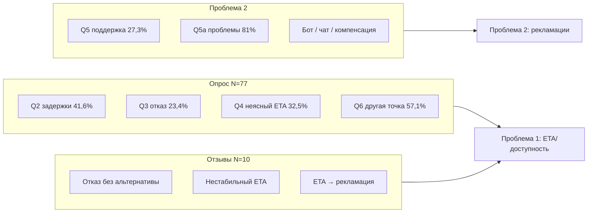

# Эмпирика — глава 2 (единая точка входа)

> **Статус:** этап 4 закрыт. Два источника данных для диагностики.

---

## Что использовать

| # | Файл | Что внутри | Для чего в гл. 2 |
|---|------|------------|------------------|
| **1** | [`результаты опросника додо.xlsx`](результаты%20опросника%20додо.xlsx) | **83 ответа**, сырые строки | Приложение, детальный разбор |
| **2** | [`опрос_агрегаты.md`](опрос_агрегаты.md) | **% и n** по Q1–Q6 | Текст §2.2–2.3, цифры в диагностике |
| **3** | [`отзывы_эмпирика_10.md`](отзывы_эмпирика_10.md) | **10 отзывов**, полные тексты | Цитаты, сценарии, качественная часть |
| **4** | [`таблица_кодирования_отзывов.md`](таблица_кодирования_отзывов.md) | Справочник кодов + таблица №1–10 | Кодирование, частоты по отзывам |

---

## Две линии проблем — где данные



---

## Быстрый старт для агента

```
Прочитай 00_СТАТУС.md.
Эмпирика: 02_эмпирика_сырьё/README.md
Цифры опроса → опрос_агрегаты.md
Цитаты → отзывы_эмпирика_10.md
```

---

## Методы (для §2.2)

1. **Онлайн-опрос** (Google Forms) — закрытые вопросы, N = 83.
2. **Вторичный анализ отзывов** — ручное кодирование, N = 10.

Интервью в текущей версии проекта **не собирались**.

---

## Ограничения (вставить в гл. 2)

- Выборки нерепрезентативны, учебный проект.
- Самоотбор: чаще отвечают пользователи с негативным опытом.
- Опрос даёт частоты; отзывы — качественные формулировки и цитаты.

---

## Связанные файлы проекта

- Глава 2 (черновик): `00_Входящие/5 этап новый.md`
- Ishikawa: `00_Входящие/исикавы.md`
- План: `07_ПЛАН_РАБОТЫ.md` · Статус: `00_СТАТУС.md`
