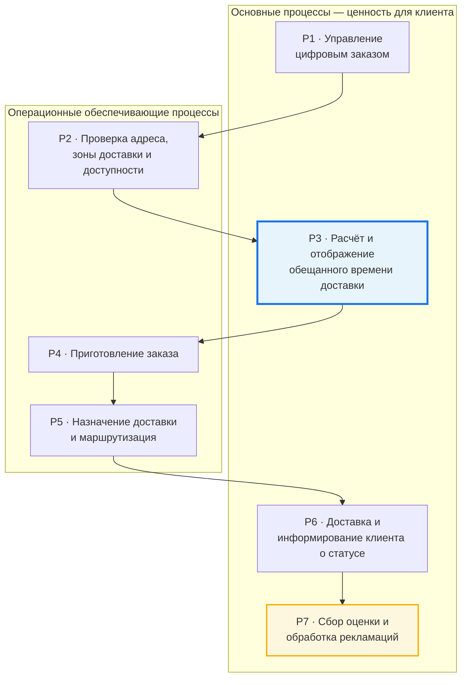
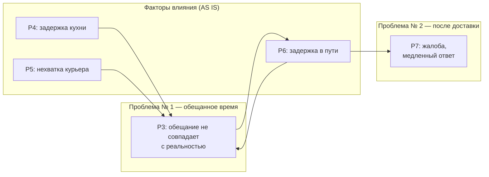

---
tags:
  - курсовая/моделирование
  - модели/landscape
  - курсовая/глава3
created: 2026-06-07
status: черновик
version: v1
object: Dodo Pizza
aliases:
  - Process Landscape
  - Карта процессов
---

# Process Landscape — цифровой контур доставки Dodo Pizza

> [!abstract] Назначение
> Верхний уровень модели: как устроен **клиентский путь** от заказа в приложении до оценки и жалобы.  
> Детальный BPMN строится только для **блока P3**; блок **P7** — упрощённая TO BE-модель.  
> См. также: [[03_РАНЖИРОВАНИЕ]] · [[07_ПЛАН_РАБОТЫ]] · [[00_СТАТУС]]

---

## Граница landscape

| В scope | Out of scope (на этой схеме) |
|---------|-------------------------------|
| Цифровой заказ, обещанное время, доставка, статус, оценка, рекламация | Маркетинг, найм, закупки, финансы |
| Dodo IS, приложение, contact center (на уровне процессов) | Детальная кухня, рецептуры, склад сырья |
| Связь «срыв ожиданий → жалоба» | Внутренние KPI без открытых источников |

---

## Соглашение о моделировании

| Уровень | Нотация | Где в проекте |
|---------|---------|---------------|
| Верхний уровень | Process Landscape / VAD | **этот файл** → Рис. в гл. 3 |
| Границы процесса | SIPOC | следующий артефакт после landscape |
| Детальный процесс | BPMN 2.0 AS IS / TO BE | блок **P3** (полный); блок **P7** (упрощённый TO BE) |
| Термины | Глоссарий BPMN | [[BPMN_глоссарий_шаблон]] |

---

## Схема (7 процессов) — нейтральный landscape

> [!warning] Landscape ≠ AS IS и ≠ TO BE
> Это **карта процессов верхнего уровня**: какие блоки есть в цифровом контуре доставки и в каком порядке они связаны.  
> Она **не показывает** будущие фичи (альтернативная пиццерия, проактивный пересчёт, ИИ в чате).  
> Что меняется при улучшении — **внутри** блоков P3 и P7; это будет в BPMN AS IS / TO BE.

> [!tip] Как читать
> - Одна **сплошная цепочка** — типичный путь заказа (есть и сейчас, и в целевом состоянии).  
> - **P3** (синий) — здесь будет детальный BPMN; разница AS IS / TO BE — *внутри* блока.  
> - **P7** (жёлтый) — вторая модель проекта; тоже детализируется отдельно.

---

## Где проявляются проблемы (не часть landscape)

Отдельная схема — **не процессы, а диагностика**: куда «болит» и что будем менять в TO BE. На защите: «это не утверждение, что так уже работает».

---

## Что добавится в TO BE (только для BPMN, не для landscape)

| Предложение команды | Где в BPMN | На landscape? |
|---------------------|------------|:-------------:|
| Проактивный пересчёт обещания при задержке | P3 TO BE (ветка C) | нет |
| Альтернативная пиццерия при перегрузе | P3 TO BE (ветка A) | нет |
| Курьер соседней точки | P3 TO BE (ветка B, под вопросом) | нет |
| ИИ-помощник оператора при жалобе | P7 TO BE | нет |

> [!note] Почему так
> Landscape отвечает на вопрос «**из каких процессов состоит контур**».  
> BPMN TO BE отвечает на вопрос «**как изменить работу внутри выбранного процесса**».

---

## Реестр процессов

### P1 · Управление цифровым заказом

| | |
|---|---|
| **Тип** | Основной |
| **Суть** | Клиент формирует корзину в приложении или на сайте, выбирает доставку, инициирует оплату. Dodo IS создаёт заказ. |
| **Вход** | Намерение заказать, корзина, адрес |
| **Выход** | Заказ в системе, готовность к проверке исполнения |
| **Роль в проекте** | Контекст; в BPMN не детализируется |

---

### P2 · Проверка адреса, зоны доставки и доступности

| | |
|---|---|
| **Тип** | Операционный обеспечивающий |
| **Суть** | Система проверяет: входит ли адрес в зону доставки, какая пиццерия обслуживает, можно ли принять заказ сейчас. |
| **Вход** | Адрес, состав заказа, время |
| **Выход** | Подтверждённая точка обслуживания или отказ / альтернатива (самовывоз) |
| **Роль в проекте** | Определяет точку обслуживания; в **TO BE** (ветка A) сюда может вернуться поток при выборе другой пиццерии |

---

### P3 · Расчёт и отображение обещанного времени доставки

| | |
|---|---|
| **Тип** | Основной |
| **Суть (нейтрально)** | Система показывает клиенту обещанное время доставки и учитывает загрузку точки, курьеров, маршрут (по открытым материалам Dodo IS). |
| **Проблема (диагностика)** | Обещание часто не совпадает с фактом; при риске срыва нет управляемого сценария для клиента — это предмет **TO BE**, не название блока на landscape. |
| **Вход** | Подтверждённый заказ, данные о точке и доставке |
| **Выход** | Заказ принят с обещанным временем (или отказ до оплаты) |
| **Роль в проекте** | **Главный BPMN** (AS IS + TO BE). Проблема № 1 из [[03_РАНЖИРОВАНИЕ]] |

> [!important] Детализация
> Следующий шаг: SIPOC → BPMN **AS IS** (реконструкция) → анализ → BPMN **TO BE** (ветки A, C, опционально B).

---

### P4 · Приготовление заказа

| | |
|---|---|
| **Тип** | Операционный обеспечивающий |
| **Суть** | Пиццерия готовит заказ на станции кухни. Влияет на срок, но внутренняя кухня в проекте **не детализируется** (out of scope SIPOC). |
| **Вход** | Принятый заказ с обещанным временем |
| **Выход** | Заказ готов к выдаче курьеру |
| **Роль в проекте** | Влияет на соблюдение обещанного времени; в **AS IS** связь с P3 может быть слабой — в **TO BE** (ветка C) добавляется проактивный пересчёт |

---

### P5 · Назначение доставки и маршрутизация

| | |
|---|---|
| **Тип** | Операционный обеспечивающий |
| **Суть** | Назначение курьера, построение маршрута, учёт транспорта и дорожной обстановки (по открытым материалам Dodo IS). |
| **Вход** | Готовый заказ |
| **Выход** | Курьер в пути, маршрут |
| **Роль в проекте** | Источник событий «нет курьера / задержка назначения»; опциональная **ветка B** (курьер соседней точки) — после диагностики |

---

### P6 · Доставка и коммуникация статуса клиенту

| | |
|---|---|
| **Тип** | Основной |
| **Суть** | Курьер доставляет заказ; клиент видит статус в приложении; при задержке — уведомления (текущее и целевое состояние). |
| **Вход** | Заказ у курьера |
| **Выход** | Заказ передан клиенту; финальный статус в приложении |
| **Роль в проекте** | Замыкание обещания времени; при срыве ожиданий — переход к **P7** |

---

### P7 · Сбор оценки и обработка рекламаций

| | |
|---|---|
| **Тип** | Основной |
| **Суть** | Клиент оценивает заказ; при проблеме — жалоба через приложение / чат / поддержку. Классификация, ответ, компенсация. |
| **Вход** | Завершённый (или сорванный) заказ, негативный опыт |
| **Выход** | Оценка, закрытое обращение, решение по компенсации |
| **Роль в проекте** | Проблема № 2 из [[03_РАНЖИРОВАНИЕ]]; **упрощённая TO BE-модель** (ИИ-помощник + человек) |

---

## Связь двух проблем проекта (логика сюжета, не landscape)

Цепочка для **главы 2** и защиты — описывает *почему* в одном курсаче две проблемы:

**P3 (сбой ожиданий по времени) → P6 (плохой опыт доставки) → P7 (жалоба)**

Это не утверждение о том, что на схеме процессов уже нарисованы улучшения — только причинная связь для диагностики.

---

## Переход к SIPOC и BPMN

| Блок | SIPOC | BPMN AS IS | BPMN TO BE |
|------|:-----:|:----------:|:----------:|
| P1 | — | — | — |
| P2 | кратко | — | — |
| **P3** | **да** | **да** | **да** |
| P4 | — | событие | — |
| P5 | — | событие | опционально |
| P6 | кратко | частично | ветка C |
| **P7** | кратко | упрощённо | **да (упрощённо)** |

---

## Экспорт для Word

| Рис. в отчёте | Файл | Статус |
|---------------|------|--------|
| Process Landscape | `process_landscape.md` (источник) | черновик |
| PNG/SVG для сдачи | `2026-06-07_landscape_v1.png` | ⏳ сделать из mermaid или draw.io |

> [!note] Для сдачи
> Перерисовать схему в draw.io / ARIS / Bizagi и экспортировать PNG. Mermaid в Obsidian — рабочий черновик и согласование с командой.

---

## Связанные заметки

- [[03_РАНЖИРОВАНИЕ]] — почему P3 главный, P7 второй
- [[02_ВАРИАНТЫ_ТЕМ]] — формулировки проблем и TO BE
- [[BPMN_глоссарий_шаблон]] — элементы нотации
- [[00_СТАТУС]] — текущий шаг проекта
