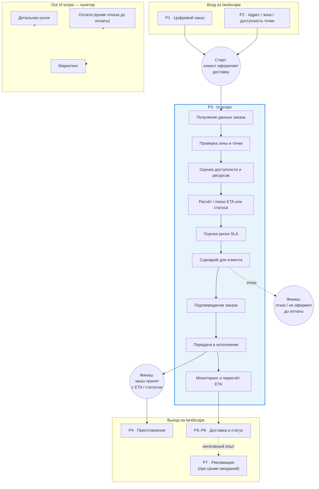
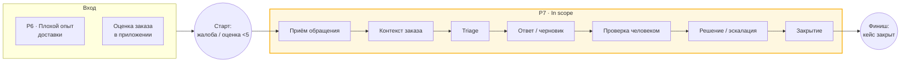
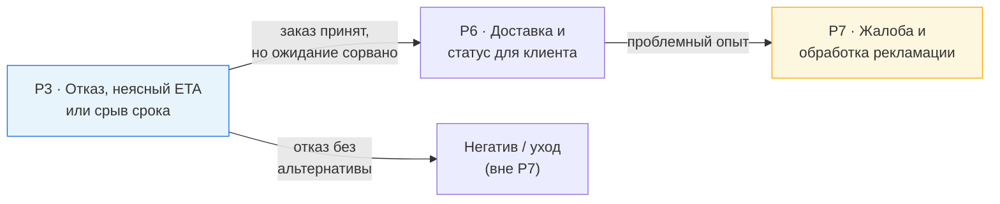

---
tags:
  - курсовая/моделирование
  - модели/sipoc
  - курсовая/глава3
  - курсовая/этап7
created: 2026-06-10
status: черновик
version: v1
object: Dodo Pizza
aliases:
  - SIPOC
  - Границы процессов
  - SIPOC P3 P7
---

# SIPOC и границы процессов — P3 и P7

> [!abstract] Назначение
> Этап 7: зафиксировать **триггер, результат, участников, входы и выходы** двух процессов **до** построения BPMN.  
> **P3** — полный SIPOC + далее полный BPMN AS IS / TO BE. **P7** — краткий SIPOC + далее упрощённая TO BE-модель.  
> См. также: [[process_landscape]] · [[03_РАНЖИРОВАНИЕ]] · [[assumptions_register]] · [[01_РАМКА_ПРОЕКТА]] · [[07_ПЛАН_РАБОТЫ]] · [[00_СТАТУС]]

---

## 1. SIPOC в иерархии моделей

| Уровень | Нотация | Артефакт проекта | Вопрос, на который отвечает |
|---------|---------|------------------|----------------------------|
| 1 | Process Landscape / VAD | [[process_landscape]] | Из каких крупных процессов состоит цифровой контур доставки? |
| 2 | **SIPOC** | **этот файл** | Кто даёт входы, что происходит на верхнем уровне, какой результат, кто потребитель — и **где границы** перед BPMN? |
| 3 | BPMN 2.0 AS IS / TO BE | этап 8–10 | Кто что делает, в какой последовательности, при каких условиях? |
| 4 | Глоссарий | [[BPMN_глоссарий_шаблон]] | Какие элементы нотации использованы на диаграмме? |

> [!tip] Методическая логика
> SIPOC используется как **высокоуровневое представление границ процесса** до построения flowchart / BPMN (ASQ; Edgeman — SIPOC, см. `01_источники/таблица_учёта_литературы.md`, поз. 13).  
> SIPOC **не заменяет** landscape и **не дублирует** BPMN: в колонке Process — 5–9 шагов верхнего уровня, **без** шлюзов, дорожек и подпроцессов.

> [!warning] SIPOC ≠ BPMN
> Здесь нет XOR/AND gateway, lane и message flow. Условия ветвления вынесены в отдельную таблицу «для этапа 8», а не в колонку Process.

---

## 2. Процесс P3 — доступность и срок доставки (ETA / риск SLA)

### 2.1. Идентификация процесса

| | |
|---|---|
| **Код на landscape** | P3 · Расчёт и сопровождение срока доставки |
| **Рабочее название для BPMN** | Обработка заказа на доставку при риске недоступности или срыва срока доставки |
| **Роль в проекте** | Проблема № 1; **главный** процесс для полного BPMN AS IS / TO BE ([[03_РАНЖИРОВАНИЕ]]) |
| **Связь с соседними блоками** | Вход из **P1** (цифровой заказ) и **P2** (проверка адреса/зоны/доступности точки). Выход в **P4** (приготовление), далее **P5–P6**. При срыве ожиданий — риск перехода клиента в **P7** |

### 2.2. События границы процесса

| | Формулировка | Тип |
|---|--------------|-----|
| **Триггер (старт)** | Клиент в приложении или на сайте **инициирует оформление заказа на доставку**: указан адрес, сформирована корзина, выбран способ «доставка» | Стартовое событие для BPMN |
| **Результат (финиш — успех)** | Заказ **принят** с понятным для клиента сроком доставки и/или статусом выполнения и **передан в исполнение** (пиццерия / контур доставки) | Конечное событие |
| **Результат (финиш — отказ)** | Клиент **не оформил заказ**: получил отказ / недоступность доставки или сознательно отказался **до оплаты** | Конечное событие |
| **Результат (финиш — пересчёт)** | После принятия заказа клиент **получил обновление** срока или уведомление о задержке (в AS IS — реконструкция; в TO BE — ветка C) | Промежуточный исход внутри сопровождения срока |

> [!note] Термин SLA в проекте
> **SLA** — аналитическая метка **риска нарушения обещанного клиенту срока** в учебном проекте, не цитата из публичного регламента Dodo ([[assumptions_register]], п. 1–2).

### 2.3. Таблица SIPOC (основная)

| Supplier (поставщики входов) | Input (входы) | Process (процесс, 5–9 шагов) | Output (выходы) | Customer (потребители результата) |
|------------------------------|---------------|------------------------------|-----------------|-----------------------------------|
| Клиент | Адрес доставки, корзина, время заказа, предпочтения (слот, комментарий) | **1.** Получение данных заказа из цифрового канала → **2.** Проверка зоны доставки и привязки к точке обслуживания → **3.** Оценка доступности точки и ресурсов (кухня, очередь, курьеры — агрегированно) → **4.** Расчёт или отображение срока доставки / статуса ожидания → **5.** Оценка риска срыва срока (SLA) → **6.** Предъявление клиенту сценария (принять / отказ / альтернатива — в TO BE) → **7.** Подтверждение заказа клиентом → **8.** Передача принятого заказа в исполнение → **9.** Мониторинг и пересчёт срока / уведомление при изменении | Заказ принят с реалистичным ETA или понятным статусом; либо отказ / недоступность; либо управляемая альтернатива до оплаты (TO BE); обновление ETA после принятия (AS IS — реконструкция) | Клиент; пиццерия (менеджер смены); курьерский контур; контур поддержки (при эскалации недовольства) |
| Приложение / сайт | Сессия, геолокация, UI-выбор доставки | *(см. колонку Process)* | Отображение ETA, статусов, сообщений об отказе | Клиент |
| Dodo IS / алгоритм ETA | Данные о зонах доставки, загрузке точки, backlog, доступности курьеров, геоданные / дорожная обстановка (по открытым материалам) | *(см. колонку Process)* | Расчётное время, флаги риска, назначение точки | Приложение; пиццерия; доставка |
| Пиццерия / операционный контур | Фактическая загрузка кухни, готовность принять заказ | *(см. колонку Process)* | Подтверждение или ограничение приёма заказа | Dodo IS; клиент (через приложение) |
| Курьерский контур / геоданные | Доступность курьеров, маршрут, транспорт | *(см. колонку Process)* | Влияние на ETA и риск задержки | Dodo IS; клиент |

### 2.4. In scope / Out of scope (границы BPMN P3)

| In scope — входит в модель | Out of scope — сознательно снаружи |
|----------------------------|-------------------------------------|
| Проверка адреса и зоны доставки (стык с P2) | Детальная работа кухни: рецептуры, станции, смены поваров |
| Проверка доступности обслуживающей / ближайшей точки | Маркетинг, акции, программа лояльности |
| Расчёт, отображение и пересчёт срока доставки для клиента | Полный цикл оплаты (кроме сценария «отказ до оплаты») |
| Оценка риска срыва срока и клиентский выбор сценария (TO BE) | HR, найм курьеров, закупки, франчайзинг |
| Подтверждение заказа и передача в пиццерию | Внутренние KPI Dodo без публичного источника |
| Мониторинг статуса и уведомления о задержке (верхний уровень) | Детальная маршрутизация «по улицам» (остаётся в P5 на landscape) |
| События «заказ принят / отказ / клиент не оформил» | Полная модель рекламации (это **P7**) |

### 2.5. Участники → дорожки BPMN (этап 8)

| Участник | Дорожка BPMN | Роль в процессе P3 |
|----------|--------------|-------------------|
| Клиент | **Клиент** | Вводит адрес и корзину; видит ETA / статус / отказ; подтверждает или отказывается от заказа |
| Мобильное приложение / сайт | **Приложение / сайт** | Интерфейс: отображение срока, статусов, кнопок выбора; приём подтверждения |
| Dodo IS, модуль прогноза и доставки | **Dodo IS / алгоритм ETA** | Проверка зоны и точки; расчёт ETA; оценка риска; пересчёт; триггер уведомлений |
| Пиццерия, менеджер смены | **Пиццерия / менеджер смены** | Подтверждение приёма заказа; сигналы о перегрузе / задержке кухни (агрегированно) |
| Курьеры, dispatch | **Доставка / курьерский контур** | Влияние на срок через назначение и статус «в пути»; события задержки |

### 2.6. Схема границ процесса P3 (Obsidian mermaid)

### 2.7. Эмпирическое обоснование границ P3

| Симптом (гл. 2) | Данные | Зачем отражено в границах P3 |
|-----------------|--------|------------------------------|
| Задержка доставки | Опрос: **41,6%** (N=77) сталкивались с задержкой (Q2) | Нужны шаги расчёта, пересчёта и уведомления (S4, S9) |
| Отказ / недоступность | **23,4%** (Q3) | Граница включает проверку доступности точки (S2–S3) и финиш «не оформил» |
| Непонятное время в приложении | **32,5%** (Q4) | ETA / статус — ядро Process, не побочный экран |
| Готовность к другой точке | **57,1%** (Q6) | Обоснование альтернативного сценария в TO BE (S6), не в AS IS как факт |
| Коды отзывов | `задержка` 7/10, `ETA_несовпадение` 5/10, `отказ_недоступность` 2/10 | Подтверждают, что граница P3 охватывает и отказ, и нестабильный срок |

Источник: [[опрос_агрегаты]] · `02_эмпирика_сырьё/таблица_кодирования_отзывов.md` · `00_Входящие/5 этап черн.md`.

### 2.8. Допущения [[assumptions_register]] → границы P3

| № | Допущение | Как отражено в SIPOC P3 |
|:-:|-----------|-------------------------|
| 1 | Правила customer-facing ETA публично не раскрыты | Process: «расчёт / отображение» — **реконструкция**; не утверждаем точную формулу |
| 2 | Поведение при перегрузе точки не описано публично | S3, S6 — развилки **для BPMN**, в SIPOC только верхний уровень |
| 3 | Проактивный пересчёт и push (ветка C) | S9 — в AS IS помечается как реконструкция; полнота — в **TO BE** |
| 4 | Альтернативная пиццерия (ветка A) | S6 — только **TO BE**; не в SIPOC как существующий шаг AS IS |
| 5 | Курьер соседней точки (ветка B) | ⏸ вне границ P3 на этапе 7, если не подтверждено; опционально P5 |
| 9 | Связь срыва срока → жалоба | Выход P3 → P7 на схеме стыковки (§5), не внутри SIPOC P3 |
| 10 | Отчёты Dodo 2018–2019 могут быть неактуальны | Факты Dodo IS — с датой источника в гл. 1; AS IS = реконструкция |

### 2.9. Условия ветвления — для BPMN (этап 8), не для колонки Process

| № | Вопрос (gateway) | Ветки (кратко) | AS IS / TO BE |
|:-:|------------------|----------------|---------------|
| G1 | Адрес в зоне доставки? | Да → далее; Нет → отказ / самовывоз | AS IS |
| G2 | Точка обслуживания может принять заказ? | Да → расчёт ETA; Нет → отказ или альтернатива | AS IS: часто отказ; TO BE: ветка A |
| G3 | Есть альтернативная точка / слот? | Да / Нет | Преимущественно **TO BE** |
| G4 | Риск срыва SLA низкий / средний / высокий? | Разные сценарии для клиента | **TO BE** (дерево решений) |
| G5 | Задержка после принятия заказа? | Пересчёт ETA, уведомление | AS IS — слабо; TO BE — ветка C |

---

## 3. Процесс P7 — обработка рекламаций

### 3.1. Идентификация процесса

| | |
|---|---|
| **Код на landscape** | P7 · Сбор оценки и обработка рекламаций |
| **Рабочее название** | Обработка клиентской рекламации по проблемному заказу |
| **Роль в проекте** | Проблема № 2; **упрощённая** TO BE-модель (не равный по объёму второй BPMN) |
| **Связь** | Вход после **P6** (доставка завершена или сорвана) или из оценки заказа в приложении |

### 3.2. События границы процесса

| | Формулировка |
|---|--------------|
| **Триггер** | Клиент **инициировал жалобу** или негативную обратную связь: оценка заказа &lt; 5, чат в приложении, обращение в contact center |
| **Результат (успех)** | Обращение **закрыто**: клиент получил ответ и решение (компенсация / извинение / иное по правилам); данные переданы для анализа качества точки |
| **Результат (эскалация)** | Сложный кейс **передан** менеджеру пиццерии или старшему оператору с зафиксированным решением |

### 3.3. Таблица SIPOC (краткая)

| Supplier | Input | Process | Output | Customer |
|----------|-------|---------|--------|----------|
| Клиент | Текст жалобы, тип проблемы, комментарий, фото, оценка заказа | **1.** Приём обращения в цифровом канале → **2.** Сбор контекста заказа → **3.** Классификация и приоритизация (triage) → **4.** Подготовка ответа / черновика → **5.** Проверка и утверждение человеком → **6.** Решение / компенсация / эскалация → **7.** Закрытие обращения | Закрытый кейс; ответ клиенту; запись для улучшения точки; при необходимости — компенсация | Клиент; оператор; менеджер пиццерии; операционный контур качества |
| Приложение / чат | История заказа, статусы, медиа | *(см. Process)* | Канал коммуникации | Клиент; оператор |
| Contact center | Очередь обращений, регламенты (публично — частично) | *(см. Process)* | Назначение оператора, SLA ответа (реконструкция) | Клиент |
| Данные заказа / Dodo IS | Номер заказа, состав, время, точка, курьер | *(см. Process)* | Контекст для triage | Оператор; ИИ-помощник (TO BE) |

### 3.4. In scope / Out of scope (P7)

| In scope | Out of scope |
|----------|--------------|
| Приём жалобы через app / чат / поддержку | Повторное приготовление на кухне (операция, не модель) |
| Классификация, triage, ответ, закрытие | Полный BPMN доставки (P3–P6) |
| Эскалация на оператора / менеджера | Маркетинг, лояльность |
| Policy matrix и ИИ-помощник | **Только TO BE**, не как факт AS IS |
| Human-in-the-loop для компенсаций | Автономные решения ИИ без человека |

### 3.5. Участники → дорожки (упрощённый BPMN TO BE)

| Участник | Дорожка | Роль |
|----------|---------|------|
| Клиент | Клиент | Подаёт жалобу, получает ответ |
| Приложение / чат | Цифровой канал | UI, передача сообщений и вложений |
| ИИ-помощник | **TO BE** | Классификация, summary, черновик ответа |
| Оператор contact center | Оператор | Проверка, простые решения, handoff |
| Менеджер пиццерии | Менеджер пиццерии | Сложные случаи, связь с точкой |
| Операционный контур | Качество / аналитика | Агрегация жалоб на точку |

### 3.6. Схема границ процесса P7

### 3.7. Эмпирическое обоснование границ P7

| Симптом | Данные | Граница |
|---------|--------|---------|
| Обращение в поддержку | **27,3%** (Q5, N=77) | Процесс начинается с цифрового обращения |
| Проблемы с ботом/чатом | **81,0%** среди обратившихся (Q5а) | Triage и NLU — зона TO BE, не «идеальный AS IS» |
| Коды отзывов | `поддержка_долго`, `поддержка_непонятно`, `чат_оператор`, `компенсация` | In scope: классификация, ответ, эскалация |

---

## 4. Стыковка P3 → P7 (логика сюжета проекта)

> [!important] Одна курсовая — два процесса
> SIPOC разделены, но **причинная связь** сохраняется для гл. 2 и защиты.

Это **не** утверждение о внутренних регламентах Dodo — логика учебного проекта ([[01_РАМКА_ПРОЕКТА]]).

---

## 5. Контрольная точка 7 (чеклист)

| Критерий | Статус | Комментарий |
|----------|:------:|-------------|
| У P3 и P7 есть стартовое и конечное событие | ✅ | §2.2, §3.2 |
| Участники для дорожек BPMN определены | ✅ | §2.5, §3.5 |
| Понятно, что входит и не входит в модель | ✅ | §2.4, §3.4 |
| Нет лишней детализации кухни, маркетинга, оплаты | ✅ | Out of scope |
| SIPOC не превращён в BPMN | ✅ | 7–9 шагов Process; gateway — отдельная таблица §2.9 |
| Есть переход от [[process_landscape]] к SIPOC | ✅ | §1, §2.1, §3.1 |
| Готово к этапу 8 (BPMN AS IS P3) | ✅ | §7 |

---

## 6. Текст для главы 3 (§3.3) — черновик

После построения модели процессов верхнего уровня (Process Landscape / VAD) для уточнения границ детализируемых процессов использована нотация SIPOC. Данный инструмент позволяет до построения диаграмм BPMN 2.0 зафиксировать поставщиков и потребителей результата, входные и выходные данные, а также верхнеуровневую последовательность действий без описания развилок и ролевого исполнения на уровне дорожек.

Для **основного процесса проекта** — обработки заказа на доставку при риске недоступности или срыва срока доставки (блок P3 на Process Landscape) — построена полная SIPOC-таблица. Триггером процесса является инициирование клиентом оформления заказа на доставку в цифровом канале; результатом — принятие заказа с понятным для клиента сроком или статусом и передача в исполнение, либо отказ клиента от оформления до оплаты. Границы процесса намеренно не включают детальное моделирование кухни, маркетинга и платёжного контура, однако охватывают проверку доступности точки, расчёт и сопровождение срока доставки, оценку риска нарушения ожиданий клиента и коммуникацию при изменении срока. Элементы модели «как есть» по внутренним правилам расчёта ETA и поведению системы при перегрузе точки относятся к реконструкции по открытым источникам и эмпирической диагностике (глава 2) с опорой на реестр допущений.

Для **связанного процесса** сбора оценки и обработки рекламаций (блок P7) SIPOC построена в сокращённом виде, поскольку в рамках курсового проекта для данной линии разрабатывается упрощённая целевая модель, а не полноценная пара диаграмм AS IS / TO BE, сопоставимая по объёму с основным процессом. Триггером выступает инициирование клиентом жалобы или негативной оценки по проблемному заказу; результатом — закрытое обращение с ответом клиенту и, при необходимости, решением о компенсации при участии оператора или менеджера пиццерии.

Таким образом, SIPOC завершает переход от обобщённой карты процессов к детальному моделированию: на следующем этапе для процесса P3 строится диаграмма BPMN 2.0 «как есть», отражающая реконструированную логику цифрового контура доставки, а для процесса P7 — упрощённая целевая модель с элементами ИИ-помощника оператора в контуре human-in-the-loop.

---

## 7. Следующий шаг — этап 8 (BPMN AS IS, P3)

| Из этого файла | Куда переносить на этап 8 |
|----------------|---------------------------|
| Старт / финиш §2.2 | Start Event / End Event на диаграмме |
| Дорожки §2.5 | Pools / Lanes |
| Gateway §2.9 | XOR-шлюзы с подписями вопросов |
| Out of scope §2.4 | Не рисовать кухню, маркетинг, оплату |
| Допущения §2.8 | Подпись «AS IS — реконструкция» + ссылка на [[assumptions_register]] |
| Проблемные места (гл. 2) | Аннотации на AS IS: отказ без альтернативы, поздний пересчёт ETA |

**Целевой артефакт:** `03_модели_экспорт/` — BPMN AS IS P3 (текстовый сценарий + mermaid-черновик или экспорт из bpmn.io).

---

## Экспорт для Word

| Рис. в отчёте | Источник | Статус |
|---------------|----------|--------|
| Таблица SIPOC P3 | этот файл §2.3 | черновик v1 |
| Таблица SIPOC P7 | этот файл §3.3 | черновик v1 |
| Схема границ P3 | §2.6 mermaid → PNG | ⏳ |
| Стыковка P3→P7 | §4 mermaid → PNG | ⏳ |

---

## Связанные заметки

- [[process_landscape]] — этап 6, блоки P1–P7
- [[03_РАНЖИРОВАНИЕ]] — выбор P3 как главного BPMN
- [[assumptions_register]] — реестр допущений AS IS / TO BE
- [[01_РАМКА_ПРОЕКТА]] — цель, ветки A/B/C, ИИ в P7
- [[BPMN_глоссарий_шаблон]] — следующий после BPMN
- [[07_ПЛАН_РАБОТЫ]] — этапы 7–8
- [[00_СТАТУС]] — статус проекта
