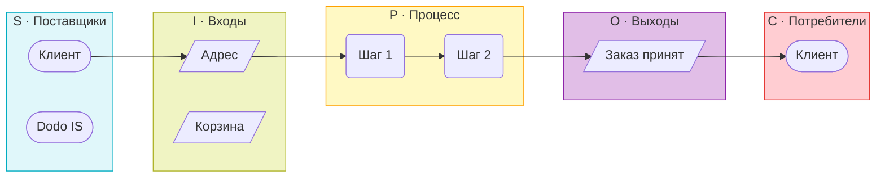

# Промпт: этап 7 — визуальный SIPOC (Obsidian / Mermaid)

> Для сторонней LLM. Эталон визуала — **5 колонок S–I–P–O–C** с овалами, параллелограммами и связями между колонками (как на приложенном скриншоте-примере).

---

## Что прикрепить к промпту

### Обязательно (8 + картинка)

| # | Файл | Зачем |
|---|------|-------|
| 0 | **Скриншот-пример SIPOC** (5 колонок, овалы/параллелограммы) | Эталон **формы** диаграммы — прикрепи изображение к сообщению |
| 1 | `03_модели_экспорт/process_landscape.md` | P1–P7, связи процессов |
| 2 | `03_модели_экспорт/sipoc_granitsy_protsessov.md` | Текущий черновик — **содержание** SIPOC (не отменять, а переложить в визуал) |
| 3 | `01_РАМКА_ПРОЕКТА.md` | Цель, ветки A/B/C, две проблемы |
| 4 | `03_РАНЖИРОВАНИЕ.md` | P3 главный, P7 второй |
| 5 | `03_модели_экспорт/assumptions_register.md` | Факт / реконструкция / TO BE |
| 6 | `02_ВАРИАНТЫ_ТЕМ.md` | Черновики триггеров и границ |
| 7 | `00_Входящие/5 этап черн.md` | Диагностика гл. 2 |
| 8 | `02_эмпирика_сырьё/опрос_агрегаты.md` | Цифры для подписей |

### Фрагмент плана (вставить текстом, не весь файл)

Из `07_ПЛАН_РАБОТЫ.md` — только:
- §2 «Принятая логика проекта»
- «Этап 7» и «Этап 8» (границы AS IS)
- п. 3.3 SIPOC
- глоссарий «SIPOC»

### Рекомендуется

- `00_Входящие/6 этап черн.md`
- `02_эмпирика_сырьё/таблица_кодирования_отзывов.md`

### Не прикреплять

- `результаты опросника додо.xlsx` — есть `опрос_агрегаты.md`
- весь `07_ПЛАН_РАБОТЫ.md` целиком

---

## Промпт (копировать целиком)

```markdown
# Задача: переработать этап 7 — ВИЗУАЛЬНЫЙ SIPOC для Obsidian

Ты — методический ассистент по BPM. Нужно **обновить** артефакт этапа 7 курсового проекта ВШЭ «Моделирование организации» (Dodo Pizza).

## Эталон визуала (ОБЯЗАТЕЛЬНО)

К сообщению приложен **скриншот-пример** классического SIPOC. Твоя диаграмма должна быть **структурно похожа**:

1. **Пять вертикальных колонок слева направо:** S → I → P → O → C.
2. **Формы элементов (в Mermaid):**
   - **S (Suppliers)** и **C (Customers)** — **овалы**: синтаксис `([Текст])`
   - **I (Inputs)** и **O (Outputs)** — **параллелограммы**: синтаксис `[/Текст/]`
   - **P (Process)** — **скруглённые прямоугольники**, **вертикальная цепочка** шагов: `(Шаг N)` и стрелки сверху вниз внутри колонки
3. **Связи между колонками** (не только таблица!):
   - Supplier → Input (один поставщик может питать несколько входов)
   - Input → Process (входы могут входить в **разные** шаги, не только в шаг 1)
   - Process → Output (выходы могут идти из **промежуточных** и финального шагов)
   - Output → Customer (один выход — несколько потребителей)
4. **Заголовки колонок** — через `subgraph` с подписями и **цветом заливки** (как на примере):
   - S — голубой/cyan
   - I — зелёный/lime
   - P — жёлтый/amber
   - O — фиолетовый/purple
   - C — красный/pink
5. Направление общей схемы: `flowchart LR`, внутри каждого subgraph — `direction TB`.

> [!warning] SIPOC ≠ BPMN
> В колонке P — **5–7 шагов**, без XOR/AND gateway, без дорожек и пулов. Развилки — максимум текстом в названии шага («оценка риска SLA»), не отдельные ромбы.

## Контекст проекта (из вложений)

- **P3** (главный): «Обработка заказа на доставку при риске недоступности или срыва срока доставки» — **полная** визуальная SIPOC-диаграмма + таблица-дубль для Word.
- **P7** (второй): «Обработка клиентской рекламации» — **упрощённая** визуальная SIPOC (меньше элементов, те же 5 колонок).
- AS IS = реконструкция; TO BE-фичи (ветка A альтернативная пиццерия, C push, ИИ в P7) **не рисовать как существующие** — только пометка в тексте или пунктиром «TO BE».
- Не выдумывать регламенты и цифры Dodo.

## Файл на выходе

Имя: `sipoc_granitsy_protsessov.md`  
Папка: `03_модели_экспорт/`

### Структура файла

1. YAML frontmatter (tags, created, status, version, aliases — как в `process_landscape.md`).
2. Callout `[!abstract]` + wikilinks.
3. §1 — SIPOC в иерархии моделей (кратко).
4. **§2 P3 — визуальная SIPOC-диаграмма** (главный блок):
   - Один блок ` ```mermaid ` с **полной** схемой 5 колонок по эталону.
   - Под диаграммой — легенда форм (овал / параллелограмм / скруглённый прямоугольник).
   - Таблица SIPOC (markdown) — **дубль для вставки в Word**, согласованная с диаграммой.
   - Триггер / финиш; in scope / out of scope; дорожки BPMN; эмпирика; допущения.
5. **§3 P7 — визуальная SIPOC** (компактнее, те же правила форм).
6. §4 — стыковка P3→P7 (отдельная небольшая mermaid).
7. §5 — чеклист этапа 7.
8. §6 — текст для гл. 3 §3.3.
9. §7 — переход к этапу 8.

## Технические требования Mermaid для Obsidian

- Используй только синтаксис, совместимый с **Obsidian** (flowchart LR + subgraph).
- ID узлов — латиница без пробелов (`s_klient`, `i_adres`, `p1`, `o_eta`).
- Подписи узлов — русский, короткие (до ~4 слов), `<br/>` для переноса.
- После диаграммы добавь блок `style` для subgraph (fill + stroke).
- Проверь: нет незакрытых subgraph, нет конфликтующих ID между P3 и P7 (префиксы `p3_` и `p7_`).

## Пример каркаса Mermaid (структура, не копировать содержание)



Заполни **реальными** поставщиками, входами, 5–7 шагами, выходами и потребителями из вложений.

## Жёсткие запреты

- Не заменять визуальную SIPOC одной markdown-таблицей.
- Не рисовать BPMN (пулы, дорожки, ромбы gateway).
- Не смешивать P3 и P7 на одной диаграмме.
- Не утверждать, что TO BE уже работает у Dodo.

## Выход

Верни **только** полное содержимое файла `sipoc_granitsy_protsessov.md`, готовое к сохранению в Obsidian.

---

## ВЛОЖЕНИЯ

[файлы из списка «Обязательно» + скриншот-пример SIPOC]
```

---

## Двухпроходная проверка (второе сообщение LLM)

После первого ответа отправь:

```markdown
Проверь `sipoc_granitsy_protsessov.md`:
1. Есть ли две отдельные mermaid-SIPOC (P3 и P7) в формате 5 колонок S-I-P-O-C?
2. Suppliers/Customers — овалы `([])`, Inputs/Outputs — параллелограммы `[/ /]`, Process — вертикальная цепочка `( )`?
3. Есть ли кросс-связи S→I→P→O→C (не только вертикаль в P)?
4. Совпадает ли содержание с `assumptions_register` и `sipoc_granitsy_protsessov` (логика не потеряна)?
5. Рендерится ли в Obsidian (нет синтаксических ошибок mermaid)?
Исправь и верни полный файл.
```
