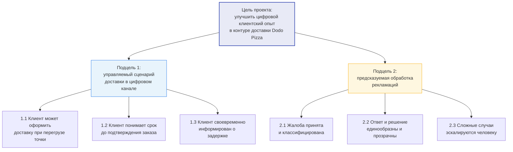
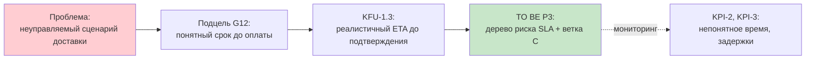

---
tags:
  - курсовая/моделирование
  - курсовая/глава2
  - курсовая/глава3
  - модели/цели
created: 2026-06-10
status: черновик
version: v1
object: Dodo Pizza
aliases:
  - Дерево целей
  - КФУ и КПЭ
  - Целевая декомпозиция
---

# Дерево целей, КФУ и КПЭ проекта

> [!abstract] Назначение
> **Целевой уровень** между диагностикой (дерево проблем, Исикава) и процессными моделями (VAD → SIPOC → BPMN).  
> Это **не** корпоративная ССП / стратегическая карта Dodo — декомпозиция **цели курсового проекта** ([[01_РАМКА_ПРОЕКТА]]).  
> См. также: [[process_landscape]] · [[sipoc_granitsy_protsessov]] · [[опрос_агрегаты]] · [[03_РАНЖИРОВАНИЕ]]

---

## 1. Границы модели

| В scope | Out of scope |
|---------|--------------|
| Цель и подцели **учебного проекта** | Финансовые цели Dodo Brands, доля рынка, HR-стратегия |
| КФУ и КПЭ **цифрового контура доставки и рекламаций** | Полная BSC с 4 перспективами по всей компании |
| Связь подцелей с **P3** и **P7** | Внутренние KPI пиццерий без публичного источника |

> [!note] Для текста главы 2
> Полная система сбалансированных показателей организации не строилась: проект ограничен операционным контуром клиентского опыта и открытыми данными. Применена **целевая декомпозиция на уровне поставленной цели курсовой работы** (адаптация логики ССП, рис. 7–9 методички).

---

## 2. Формулировка цели (корень дерева)

**Цель проекта** (из [[01_РАМКА_ПРОЕКТА]]):

Разработать на основе моделирования бизнес-процессов и эмпирической диагностики **комплекс управленческих решений** по совершенствованию цифрового клиентского опыта Dodo Pizza в контуре доставки, направленный на:

1. снижение риска недоступности заказа и срыва норматива доставки;
2. повышение эффективности обработки клиентских рекламаций в цифровых каналах.

**SMART-черновик** *(для финальной редакции в введении)*:

| Критерий | Черновик |
|----------|----------|
| **S** | Цифровой контур доставки и рекламаций (приложение / сайт / поддержка) |
| **M** | КПЭ процессов P3 и P7 (таблица §5); базовый уровень — опрос N=77 |
| **A** | Решения реализуемы на базе Dodo IS по открытым материалам + предложения TO BE |
| **R** | Согласовано с диагностикой гл. 2 и ранжированием [[03_РАНЖИРОВАНИЕ]] |
| **T** | Горизонт внедрения в отчёте — **целевое состояние** (TO BE), не срок контракта Dodo |

---

## 3. Дерево целей проекта (рисунок для гл. 2 или 3.1)

> Принцип декомпозиции: «**что нужно достичь, чтобы…**» (логика стратегической карты, без финансовой перспективы Dodo).

### Связь подцелей с процессами и главами

| Узел дерева | Процесс (landscape) | Глава / модель |
|-------------|---------------------|----------------|
| G1, G11–G13 | **P3** (главный), стык **P2** | гл. 3: SIPOC, BPMN AS IS / TO BE |
| G2, G21–G23 | **P7** | гл. 3: упрощённая TO BE |
| Диагностика всех узлов | P2–P7 (симптомы) | гл. 2: дерево проблем, Исикава, опрос |

---

## 4. КФУ — ключевые факторы успеха

> **КФУ** — условия, без которых подцель **не считается** достигнутой, даже если процесс формально изменён.  
> КФУ → элементы **BPMN TO BE** (не утверждение, что так уже у Dodo).

### 4.1. Линия P3 — доступность и срок доставки

| Подцель | ID | КФУ (must have в TO BE) | Элемент TO BE | Допущение |
|---------|:--:|-------------------------|---------------|-----------|
| G11 | KFU-1.1 | До оплаты система **проверяет** доступность обслуживающей точки | Ядро проверки доступности | Реконструкция AS IS — [[assumptions_register]] №2 |
| G11 | KFU-1.2 | При перегрузе ближайшей точки клиенту **предлагается альтернатива** (другая точка / слот / отказ) | Ветка A | TO BE, не факт AS IS — №4 |
| G12 | KFU-1.3 | Клиент видит **реалистичный срок** или явное объяснение статуса **до** подтверждения | Ядро + дерево риска SLA | №1 |
| G12 | KFU-1.4 | При среднем/высоком риске SLA клиент получает **управляемый выбор**, а не скрытый риск | Дерево решений по риску | TO BE |
| G13 | KFU-1.5 | При изменении ETA после принятия заказа клиент получает **проактивное уведомление** | Ветка C | TO BE — №3 |
| G13 | KFU-1.6 | Пересчёт срока учитывает сигналы кухни/курьеров (агрегированно), а не только стартовый ETA | Связь P3 ↔ P4/P5 (события) | Реконструкция |

### 4.2. Линия P7 — рекламации

| Подцель | ID | КФУ (must have в TO BE) | Элемент TO BE | Допущение |
|---------|:--:|-------------------------|---------------|-----------|
| G21 | KFU-2.1 | Обращение **автоматически обогащается** контекстом заказа (номер, состав, статусы) | ИИ-помощник / triage | TO BE — №7 |
| G21 | KFU-2.2 | Жалоба **классифицируется** по типу и приоритету до ручной рутины | ИИ-triage + правила | TO BE |
| G22 | KFU-2.3 | Ответ опирается на **единую policy matrix** по типам жалоб | Policy matrix | TO BE — №8 |
| G22 | KFU-2.4 | Компенсации и спорные решения **утверждает человек** | Human-in-the-loop | TO BE |
| G23 | KFU-2.5 | Сложный кейс **эскалируется** менеджеру точки / старшему оператору с резюме | Handoff в BPMN P7 | Реконструкция handoff AS IS — №6 |
| G23 | KFU-2.6 | NLU в чате **снижает долю** немотивированной эскалации на оператора | Улучшение бота до эскалации | TO BE |

---

## 5. КПЭ — ключевые показатели эффективности

> **КПЭ** — измеримые индикаторы: *насколько* достигнута подцель.  
> **Базовый уровень (AS IS)** — из опроса / отзывов, где есть. **Целевое направление (TO BE)** — качественно; точные % без пилота **не выдумывать**.

### 5.1. Сводная таблица КПЭ

| ID | Подцель | КПЭ | Тип | Базовый уровень (эмпирика) | Направление TO BE | Источник базы | Связанные КФУ |
|:--:|---------|-----|-----|---------------------------|-------------------|---------------|---------------|
| KPI-1 | G11 | Доля респондентов, сталкивавшихся с **отказом / недоступностью** доставки | Запаздывающий | **23,4%** (18/77) | Снижение | Q3, [[опрос_агрегаты]] | KFU-1.1, 1.2 |
| KPI-2 | G12 | Доля респондентов с **непонятным временем** в приложении | Запаздывающий | **32,5%** (25/77) | Снижение | Q4 | KFU-1.3, 1.4 |
| KPI-3 | G12 | Доля респондентов, сталкивавшихся с **задержкой** | Запаздывающий | **41,6%** (32/77) | Снижение | Q2 | KFU-1.3, 1.5 |
| KPI-4 | G11 | **Готовность** к доставке из другой точки при честном ETA | Опережающий | **57,1%** «да / скорее да» | Использовать как допуск ветки A | Q6 | KFU-1.2 |
| KPI-5 | G13 | Доля отзывов с кодом **`нет_уведомления`** | Запаздывающий | **2 из 10** отзывов | Снижение | кодирование отзывов | KFU-1.5 |
| KPI-6 | G13 | Доля отзывов с кодами **`ETA_несовпадение`**, **`задержка`** | Запаздывающий | **5/10** и **7/10** | Снижение | таблица кодирования | KFU-1.5, 1.6 |
| KPI-7 | G2 | Доля респондентов, **обращавшихся в поддержку** | Запаздывающий | **27,3%** (21/77) | Снижение *косвенно* (через P3) | Q5 | KFU-1.x |
| KPI-8 | G21–G23 | Доля обратившихся с **проблемами бота/чата** | Запаздывающий | **81,0%** (17/21) | Снижение | Q5а | KFU-2.1, 2.6 |
| KPI-9 | G12–G13 | **Точность ETA** (MAE / MAPE) | Опережающий | Нет данных Dodo | Улучшение (концептуально) | литература last-mile | KFU-1.3, 1.6 |
| KPI-10 | G13 | **On-time delivery %** / доля заказов в SLA | Запаздывающий | Нет публичных KPI | Улучшение (концептуально) | [ТРЕБУЕТСЯ ИСТОЧНИК] | KFU-1.4, 1.5 |
| KPI-11 | G22 | **Время до первого ответа** по жалобе | Запаздывающий | Нет публичных KPI; качественно в отзывах | Сокращение | отзывы `поддержка_долго` | KFU-2.3, 2.4 |
| KPI-12 | G22 | **Однородность решений** (доля кейсов по policy matrix) | Опережающий | Нет данных | Рост | TO BE policy matrix | KFU-2.3 |

> [!warning] Про KPI-9, 10, 11
> В отчёте: «показатели определены как **целевые метрики мониторинга** TO BE; количественный прогноз не приводится из‑за отсутствия внутренних данных Dodo».

### 5.2. Опережающие vs запаздывающие (для абзаца в гл. 2)

| Тип | Смысл | Примеры в проекте |
|-----|-------|-------------------|
| **Опережающие** | Предсказывают / сопровождают достижение цели | Готовность к другой точке (KPI-4); точность расчёта ETA (KPI-9); доля кейсов по policy matrix (KPI-12) |
| **Запаздывающие** | Фиксируют уже случившийся результат | % отказов (KPI-1); % задержек (KPI-3); обращения в поддержку (KPI-7) |

---

## 6. Цепочка «проблема → цель → КФУ → КПЭ → TO BE»

Пример для защиты (линия P3):

---

## 7. Куда вставить в отчёт

| Артефакт | Рекомендуемое место | Номер рисунка |
|----------|---------------------|---------------|
| Дерево целей §3 | **Гл. 2**, параграф 2.6 или 2.7 «Целевая декомпозиция» | Рис. 2.x |
| Таблица КФУ §4 | Гл. 2 (таблица) или **приложение** | Табл. 2.x |
| Таблица КПЭ §5 | Гл. 2 + ссылка в гл. 3 §3.5.1 «Критерии оптимизации» | Табл. 2.x / 3.x |
| Цепочка §6 | Гл. 3 при обосновании TO BE | Рис. 3.x |

### Черновик заголовка параграфа (гл. 2)

**2.7. Целевая декомпозиция проекта: дерево целей, ключевые факторы успеха и показатели эффективности**

*(2–3 абзаца: зачем не полная ССП; как подцели связаны с P3/P7; как КПЭ опираются на опрос.)*

---

## 8. Чеклист перед защитой

| Вопрос | Где ответ |
|--------|-----------|
| Какая главная цель? | §2, [[01_РАМКА_ПРОЕКТА]] |
| Чем подцели отличаются от проблем? | Проблема = что не так **сейчас**; подцель = желаемое **состояние** |
| Чем КФУ отличается от КПЭ? | §4 vs §5; КФУ = условие в TO BE, КПЭ = метрика |
| Почему нет финансовой перспективы BSC? | §1 |
| Как КПЭ связаны с опросом? | §5.1, колонка «базовый уровень» |
| Как это ведёт к BPMN? | §4 «элемент TO BE» → [[sipoc_granitsy_protsessov]] → BPMN |

---

## 9. Следующие шаги команды

1. Вставить §3 (mermaid) в гл. 2; подписать рисунок по ГОСТ.
2. Сократить таблицы §4–§5 для Word (или вынести полные в приложение).
3. В гл. 3 §3.5.1 скопировать KPI-1–8 как **критерии сравнения AS IS / TO BE**.
4. В заключении — 1 абзац: «достижение цели предполагает выполнение КФУ … мониторинг по КПЭ …».
5. Опционально: добавить строку в [[07_ПЛАН_РАБОТЫ]] — этап 5.5 «целевая декомпозиция».

---

## Связанные заметки

- [[01_РАМКА_ПРОЕКТА]] — цель и задачи
- [[03_РАНЖИРОВАНИЕ]] — P3 / P7
- [[assumptions_register]] — что TO BE, что реконструкция
- [[опрос_агрегаты]] — базовые цифры КПЭ
- [[process_landscape]] · [[sipoc_granitsy_protsessov]]
- `00_Входящие/5 этап черн.md` — диагностика гл. 2
