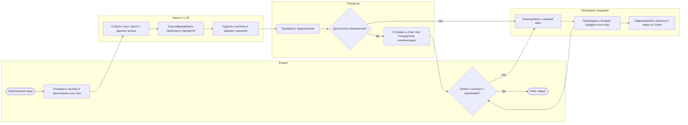
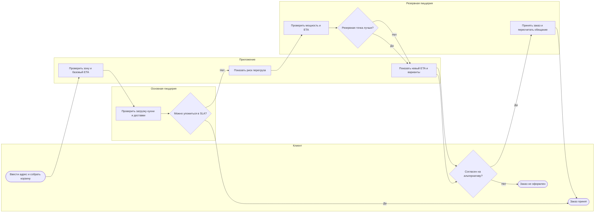
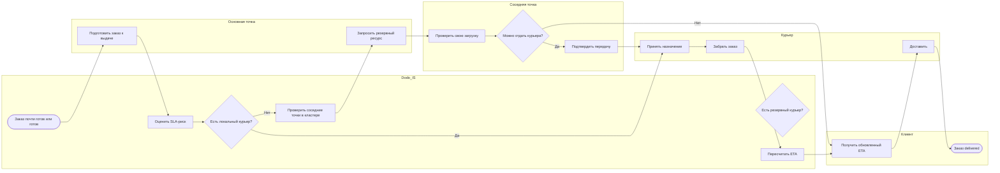
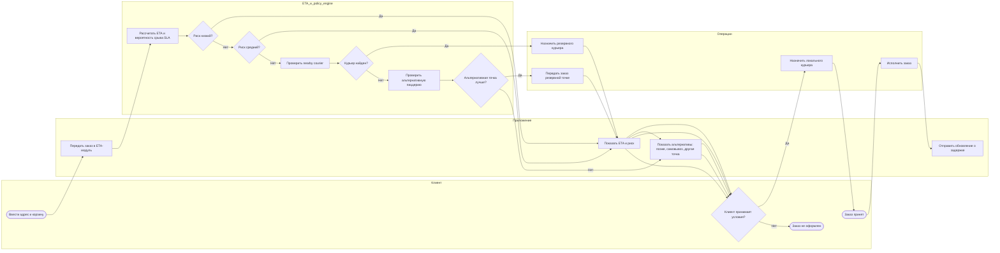
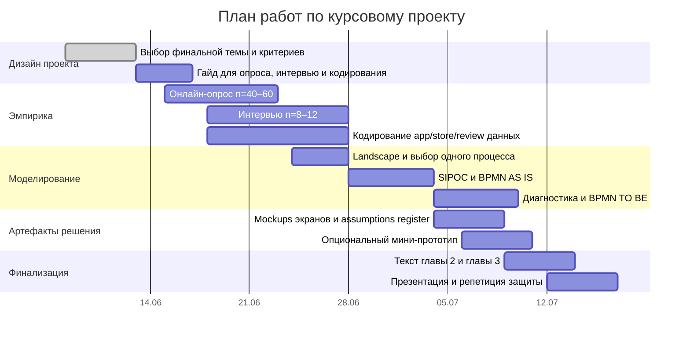

# Аналитический выбор темы курсового проекта по моделированию бизнес-процессов Додо Пиццы

> **Актуальный shortlist команды:** только **2 темы** — см. `02_ВАРИАНТЫ_ТЕМ.md`. Этот файл — полная deep research аналитика (источники, BPMN mermaid, план эмпирики).

## Резюме для выбора темы

Для вашей курсовой оптимален не отдельный «алгоритм», а **управленческий процесс**, где алгоритм выступает инструментом TO BE. Это полностью совпадает с рамкой вашего пакета: нужно ранжирование процессов, один выбранный процесс для BPMN, открытые источники без инсайдеров и нетривиальное улучшение, которое компания реально могла бы внедрить, а не косметически «перерисовать схему».  
**Актуализация рамки от 09.06.2026:** тема № 1 формулируется шире, как управление **доступностью и сроком доставки**: при перегрузе ближайшей точки клиент может получить отказ/недоступность без альтернативы, а при принятом заказе ETA/статус может быть неясным или срываться. fileciteturn0file0

По совокупности критериев я рекомендую сделать **финальной темой** вариант **динамического прогнозирования ETA и управления риском срыва SLA доставки**. Причина в том, что он лучше всего объединяет все обсужденные идеи в один защищаемый процесс: честное обещание времени клиенту, решение о принятии заказа, предложение альтернатив, а в исключениях — переназначение курьера или резервной пиццерии. У Dodo есть публично описанные элементы именно такого контура: Dodo IS прогнозирует время доставки с учетом дорог и транспорта, подсвечивает заказы по риску ETA, помогает решать, какие адреса брать в одну поездку, а текущий корпоративный сайт прямо говорит, что Dodo IS отслеживает заказы, прогнозирует спрос и управляет labor/logistics. citeturn32view0turn42view0turn47view0

**Резервной темой** я бы держал **обработку клиентских рекламаций с LLM‑помощником для чат‑бота и оператора**. Это самый «железобетонный» вариант по открытым данным: официальный отчет Dodo описывает app-based feedback, типовые проблемы, фото, передачу в систему обработки обратной связи и контакт менеджера с клиентом в течение дня. Кроме того, у Dodo есть близкий vendor case по AI-коммуникациям с клиентами через Tovie. citeturn32view1turn23view0

Итоговый рейтинг идей для вашей курсовой таков:  
**доступность + динамический ETA и SLA-дерево решений** → **рекламации с LLM-assisted support** → **кластерное перераспределение курьеров** → **перегруз точки и перенаправление заказа на альтернативную пиццерию**. Идеи про альтернативную пиццерию и межточечное перераспределение курьеров сильнее выглядят **как ветки TO BE внутри темы доступности/ETA/SLA**, чем как самостоятельные финальные темы. Это связано с тем, что публичных доказательств текущих правил Dodo по межточечному перераспределению заказов и курьеров я не нашел; их можно предлагать только как улучшение, а не как уверенно реконструированный AS IS. citeturn32view0turn42view0turn47view0

## Источники, допущения и реальные рыночные кейсы

База по Dodo из открытых источников у вас достаточно сильная, но она **неравномерная**. Самые полезные официальные материалы — это прозрачные отчеты Dodo за 2018/2019 годы и текущий корпоративный сайт Dodo Brands. Из отчетов следует, что Dodo публично измеряла и улучшала доставку: поставила цель снизить среднее время в Евразии с 43 до 27 минут и за год сократила его до 35 минут; Dodo IS на станции доставки прогнозировала время, учитывала пробки и транспорт, подсвечивала заказы от 30 до 45 минут желтым и свыше 45 минут красным, а также помогала собрать оптимальный маршрут. В том же отчете сказано, что компания разработала инструмент проектирования зон доставки на основе исторических данных о пробках. citeturn32view0

По клиентскому опыту официальный материал еще конкретнее. Dodo запустила обратную связь в приложении: клиент может поставить оценку заказу, а если оценка ниже пяти — выбрать типовую проблему, добавить комментарий и фотографии; далее отзыв попадает в систему обработки обратной связи, а менеджер пиццерии связывается с клиентом в течение дня и решает вопрос по корпоративным принципам. За полгода компания получила более миллиона оценок со средним баллом 4,8/5. Это редкий случай, когда публичный источник почти целиком описывает реальный сервисный процесс. citeturn32view1

Цифровой контур у Dodo тоже хорошо подтвержден. В российской сети приложение в 2019 году давало 40% продаж и 65% выручки доставки, а сайт служил каналом привлечения новых клиентов; там же Dodo описывает функцию address snare, когда пользователь оставляет контакт, если его адрес пока вне зоны доставки. На текущем сайте Dodo Brands уже в 2026 году Dodo IS описан как all-in-one платформа, которая охватывает contact center, customer mobile app, website, aggregators, order tracking, delivery management и delivery app; на отдельной franchise-странице прямо сказано, что платформа tracks orders, forecasts demand, manages labor and logistics. Эти текущие страницы не раскрывают SOP покомпонентно, но подтверждают, что контакт-центр, order tracking, delivery management и прогнозирование спроса действительно входят в операционный контур Dodo. citeturn32view2turn47view0turn42view0

Сходные реальные кейсы подтверждают реализуемость класса решений, которые вы обсуждали. Наиболее близкий кейс к Dodo — **Tovie AI**: по заявлению вендора, европейскому подразделению Dodo во время пандемии нужен был более дешевый и управляемый инструмент возвращения «потерянных» клиентов, потому что внешний call center был дорогим, слабым по качеству и давал плохую аналитику; voice bot обзванивал ушедших клиентов, собирал причины оттока, отправлял промокоды, а после масштабирования на десятки пиццерий проект, по данным кейса, снизил стоимость контакта втрое и дал среднюю конверсию лида 27%. Это не прямой аналог рекламаций, но сильное подтверждение, что AI-assisted client communication для Dodo операционно осмыслен. citeturn23view0

Для темы рекламаций полезен и внешний аналог из customer care. Lyft в 2025 году сообщила, что использует Claude для customer care, и, по данным Reuters, среднее время решения обращений упало на 87%; при этом Lyft отдельно подчеркивала, что сложные кейсы вроде safety, fraud и деактиваций остаются за людьми. Именно такой **human-in-the-loop**, а не fully autonomous bot, и является лучшей архитектурой для вашей идеи про LLM‑помощника. citeturn44news1

Для тем ETA, альтернативной точки и перераспределения курьеров полезна не только Dodo, но и операционная литература на реальных данных. Uber в системе DeeprETA показала, что post-processing ETA поверх стандартного route-planning улучшает mean и median absolute error в онлайн и офлайн тестах. Для on-demand delivery from stores исследование на реальном датасете крупной grocery chain показало улучшение delivery time на 36,53% против текущей политики. Для multi-depot last mile опубликованы результаты по pooled delivery from multiple depots и flash delivery на реальных данных из Амстердама: multiple depots и rolling-horizon planning дают более быстрый и гибкий сервис. Эти источники не доказывают, что Dodo уже делает то же самое, но они подтверждают, что ваши идеи **алгоритмически и организационно не фантастичны**. citeturn30academia0turn37academia3turn37academia1turn37academia2

Есть и важные **антикейсы**. DPD в 2024 году отключила часть AI-компонента чат-системы после резонансного сбоя, когда бот начал давать неприемлемые ответы; это прямое напоминание, что LLM в клиентском сервисе требует строгих guardrails и handoff к человеку. Еще жестче выглядит недавний спор вокруг Pizza Hut/Dragontail: по утверждению франчайзи в иске 2026 года, AI-система управления доставкой ухудшила показатели, позволив DoorDash-драйверам видеть кухонные статусы и батчить заказы, что якобы привело к более поздним и холодным доставкам. Это именно **утверждения истца, а не установленный судом факт**, но как риск-индикатор кейс очень полезен: алгоритм может улучшать локальную метрику и одновременно ломать реальные стимулы исполнителей. citeturn16news0turn45news0

Из этого следует главное методическое правило для вашей работы: **все, чего нет в официальных текстах Dodo, нужно маркировать как реконструкцию или допущение**. В частности, я не нашел публичного подтверждения, что Dodo уже умеет перенаправлять заказ на другую пиццерию при перегрузе, и не нашел надежного публичного описания межточечного перераспределения курьеров. Поэтому обе идеи допустимы как TO BE, но опасны как «доказанный текущий AS IS». Это полностью совпадает и с логикой вашего подготовленного файла: при открытых источниках без инсайдеров проект должен строиться как честная реконструкция наблюдаемого процесса, а не как выдуманная внутренняя инструкция. fileciteturn0file0

## Сравнительная оценка идей

Ниже — оценка по тем критериям, которые уже зафиксированы в вашем пакете: открытые данные, нетривиальность TO BE, богатство BPMN, возможность внешней эмпирики без инсайдеров и связь с темой команды. Для курсовой особенно важно, чтобы процесс был **защищаем на viva**, то есть чтобы на вопрос «откуда вы знаете, что это проблема?» у вас был ответ в виде официальных материалов, интервью, обзора отзывов и прозрачного списка допущений. fileciteturn0file0

| Идея | Открытые данные | Богатство BPMN | Нетривиальный TO BE | Защищаемость | Связь с вашей линией про доставку | Итог |
|---|---:|---:|---:|---:|---:|---|
| Динамический ETA и SLA-дерево решений | 4 | 5 | 5 | 4 | 5 | **Лучший финальный выбор** |
| Рекламации с LLM-assisted support | 5 | 4 | 4 | 5 | 4 | **Лучший backup** |
| Кластерное перераспределение курьеров | 3 | 5 | 4 | 3 | 5 | Сильная ветка TO BE, слабее как standalone |
| Перегруз точки и альтернативная пиццерия | 2 | 4 | 4 | 2 | 5 | Лучше использовать как сценарий внутри доступности/ETA/SLA |

Первое место у темы **динамического ETA** не потому, что она на 100% лучше по данным, а потому, что она лучше **собирает весь ваш сюжет в один процесс**: честное обещание времени, отказ от нереалистичного acceptance, альтернативная точка, альтернативный слот, межточечное подключение курьера и постфактум уведомление клиенту. Это делает BPMN богаче, чем у чисто complaint-flow, и отвечает ожиданию преподавателя о «продукте, который купила бы компания», а не только о сокращении ручных шагов. При этом у темы уже есть официальная опора в Dodo-материалах про ETA, маршрутизацию, order tracking и demand forecasting. fileciteturn0file0turn32view0turn42view0turn47view0

Второе место у темы **рекламаций с LLM** потому, что это самый защищаемый автономный кейс: Dodo официально описывает сбор отзывов, типизацию проблем, фото и срок ответа менеджера; текущий tech stack Dodo включает contact center; внешний рынок уже движется в сторону AI-assisted customer care с handoff к человеку. Если руководитель захочет максимально «жесткое» обоснование без больших допущений, именно эта тема проще всего проходит защиту. citeturn32view1turn47view0turn44news1

Темы **альтернативной пиццерии** и **кластерного перераспределения курьеров** интересны, но у обеих выше объем недоказуемых допущений. Их не стоит выбрасывать — наоборот, они очень ценны как **исключительные ветки TO BE** внутри общей темы доступности/ETA/SLA. Но как отдельные финальные темы они слабее именно в части defendability: без внутренних данных Dodo вы не можете уверенно утверждать ни сколько заказов теряется из-за перегруза точки, ни как именно сейчас устроены boundaries между курьерами разных точек. citeturn32view0turn42view0turn47view0

## Идея рекламаций и LLM‑помощника

### Краткое описание

Суть идеи — не «сделать чат-бот умнее», а **стандартизировать и ускорить процесс обработки клиентских обращений по проблемным заказам**. В этой формулировке LLM — не замена менеджеру, а слой triage, суммаризации, подготовки варианта ответа и рекомендаций по компенсации/эскалации. Это хорошо бьется с публичным процессом Dodo, где клиент уже может поставить низкую оценку, выбрать типовую проблему, написать комментарий и добавить фото, а менеджер должен связаться с ним в течение дня. citeturn32view1turn47view0

### AS IS и TO BE

**AS IS-реконструкция.** После заказа клиент оценивает заказ в приложении; если оценка ниже 5, он выбирает типовую проблему, описывает ситуацию и при необходимости прикладывает фото. Эта информация уходит во внутреннюю feedback system, а менеджер пиццерии в течение дня связывается с клиентом и по корпоративным принципам выбирает формат решения — извинение, подарок, компенсацию или возврат. Текущий corporate tech stack Dodo также включает contact center, но детальная публичная схема handoff между app feedback, чатом и звонками не раскрыта; это должно быть помечено как [ДОПУЩЕНИЕ] и проверено интервью. citeturn32view1turn47view0

**TO BE.** Любая жалоба из app/chat/contact center сначала проходит через AI-assisted triage: система классифицирует проблему, подтягивает контекст заказа, делает сжатое summary, предлагает оператору или менеджеру шаблон ответа и допустимые решения по policy matrix. Простые случаи закрываются быстро; сложные, конфликтные или дорогие — уходят на эскалацию человеку. Такая архитектура соответствует и официальной логике Dodo, где решение по компенсации остается за менеджером, и внешним AI customer care кейсам вроде Lyft, где сложные темы остаются у людей. citeturn32view1turn44news1turn24news3

Ниже — компактная BPMN-ready Mermaid-диаграмма этого процесса; логика основана на официально описанных Dodo feedback steps и на рекомендованной human-in-the-loop архитектуре. citeturn32view1turn44news1

### Данные, алгоритм, реализуемость и риски

**Нужные данные и входы.** Order ID, канал обращения, текст сообщения, выбранная типовая проблема, вложенные фото, история заказов и обращений клиента, policy matrix по компенсациям, статус пиццерии, история аналогичных кейсов. Официальный Dodo flow уже подтверждает, что problem type, comment и photo attachments логически существуют в продукте. citeturn32view1

**Подход.** Для MVP достаточно связки из retrieval + rules + LLM: классификация намерения, извлечение сущностей, summary обращения, подбор рекомендаций из policy matrix и draft response для оператора. Генеративная часть не должна сама утверждать денежные компенсации. На рынке это соответствует agent-assist, а не laissez-faire chatbot: именно так AI используется в кейсе Lyft customer care, и именно такой подход снижает риск провала типа DPD. citeturn44news1turn16news0turn24news3

**Реализуемость.** Для курсовой — **высокая**. Для реального продакшна — **средняя/высокая**, потому что Dodo уже имеет feedback loop и contact center modules, а значит TO BE не требует менять core ordering flow. Самый реалистичный опциональный прототип — не «боевой бот», а demo на 20–30 обезличенных кейсах: классификация жалобы и черновик ответа. citeturn32view1turn47view0

**Риски.** Главные риски — hallucination, неверная компенсация, privacy leakage, prompt injection через вложения и появление у клиента ощущения, что с ним разговаривает «бесполезный бот». DPD-антикейс показывает, что автономный customer-facing AI без guardrails быстро становится репутационным риском. Поэтому для защиты лучше прямо писать, что LLM в вашем TO BE — это **assistant for operator/manager**, а не самостоятельный decision maker. citeturn16news0turn44news1

**Как собирать эмпирику.** Ваша сильнейшая эмпирика здесь — survey + interviews по реальным complaint journeys: сталкивался ли респондент с неправильным/холодным заказом, жаловался ли, куда, как быстро получил ответ, был ли ответ справедливым. Дополнительно можно вручную закодировать 80–120 публичных отзывов о приложении/сервисе по темам «долгий ответ», «непонятный саппорт», «возврат/компенсация», «задержка заказа», а затем использовать эти коды в Ishikawa/дереве проблем. Это полностью соответствует вашей методической рамке про вторичные данные и внешнюю эмпирику без инсайдеров. fileciteturn0file0

**Метрики.** First response time, median resolution time, share cases resolved without повторного контакта, escalation rate, post-case CSAT/NPS, complaint answer rate, repeat complaint rate по одной и той же точке, accuracy of policy recommendation. Официальный ориентир «в течение дня менеджер связывается с клиентом» можно использовать как baseline-требование AS IS. citeturn32view1

**Артефакты для курсача.** Landscape блока «послепродажный сервис», SIPOC процесса рекламации, BPMN AS IS и TO BE, assumptions register, policy matrix по типам жалоб, сценарии handoff bot→operator→manager, mockups экрана чата и operator console, опционально — mini-demo complaint triage.

## Идея перегруза точки и альтернативной пиццерии

### Краткое описание

Суть идеи — если обслуживающая пиццерия перегружена, **не терять заказ молча**, а предложить клиенту альтернативный сценарий: более длинный ETA, другое окно, самовывоз или выполнение заказа резервной пиццерией. Это сильная продуктовая логика, но именно как отдельная тема она упирается в слабое место: публичных доказательств того, что Dodo уже сейчас часто сталкивается с отказом в заказе именно из-за локальной перегрузки точки, мало. Поэтому тему можно брать только при сильной внешней эмпирике и очень честном assumptions log. fileciteturn0file0

### AS IS и TO BE

**AS IS-реконструкция.** Dodo уже работает как digital-first order flow: приложение и сайт — важные каналы, приложение приносило значительную долю delivery revenue; при этом компания отдельно развивала delivery zones и даже address snare для адресов вне зоны. В delivery-направлении Dodo публично описывает инструмент проектирования зон доставки по историческим данным о пробках. На этом основании можно реконструировать базовый AS IS: клиент вводит адрес, система проверяет зону и применимость точки, затем рассчитывает ETA и принимает/не принимает заказ. Но точный current rule set — что происходит при локальном kitchen/delivery overload — публично не раскрыт. citeturn32view2turn32view0

**TO BE.** При перегрузе обслуживающей точки система не просто отказывает, а запускает **alternative fulfillment check**: можно ли отдать заказ соседней пиццерии быстрее и без потери качества. Если да, клиенту показываются новый ETA, условия и выбор: согласиться, выбрать другой слот, уйти в самовывоз или отказаться до оплаты. Важно, что перераспределение на альтернативную точку лучше делать не как дефолт, а как controlled exception. Близкий operational analogue существует в multi-depot fulfillment research, где выбор другого депо/fulfillment center при uncertainty по сроку улучшает соблюдение expected delivery dates, но это пока именно аналог, а не доказанный Dodo practice. citeturn38academia0turn37academia1

Ниже — BPMN-ready схема такого процесса как **исключительного сценария при перегрузе**. Она годится для TO BE, но AS IS с такой логикой без внутренних данных утверждать нельзя. citeturn32view2turn32view0

### Данные, алгоритм, реализуемость и риски

**Нужные данные и входы.** Геометрия delivery zones, текущая и прогнозная загрузка кухни, backlog заказов, доступные курьеры/рейсы, prep time, travel time, distance-to-customer, рейтинг/качество точки, unit economics, допустимые ограничения франчайзинга. Официально подтверждены digital channel, zone design tooling и route/ETA layer; everything else beyond that должно быть помечено как [ДОПУЩЕНИЕ]. citeturn32view2turn32view0

**Подход.** Для курсовой здесь лучше не «сложный ML», а **scoring + optimization**: выбрать альтернативную точку по score, который учитывает ETA, backlog, available couriers, distance, risk of lateness и влияние на качество. Как теоретический аналог можно сослаться на contextual optimization under delivery time uncertainty и multi-depot pooled delivery. citeturn38academia0turn37academia1

**Реализуемость.** Как standalone тема — **средняя/низкая**; как TO BE-ветка в общей теме доступности/ETA/SLA — **средняя**. Основная проблема не в математике, а в доказательности: вам будет сложно убедительно показать AS IS без очень хороших интервью, скриншотов пользовательского опыта и обзора отзывов.

**Риски.** Риски здесь не только алгоритмические, но и организационные: межточечный transfer может бить по unit economics франчайзи, вызывать конфликты ownership за выручку, ухудшать food quality из-за длинного плеча и ломать ожидание клиента. Самый опасный риск на защите — вопрос «откуда вы знаете, что Dodo вообще готова или способна так передавать заказ между точками?» На этот вопрос у вас должен быть честный ответ: «мы этого не утверждаем; это TO BE-гипотеза». fileciteturn0file0

**Как собирать эмпирику.** Здесь нужны именно **symptom-based данные**: было ли у респондентов, что доставка была недоступна или ETA резко рос уже до оформления заказа; готовы ли они принять альтернативную точку при честно показанном более длинном ETA; что для них хуже — отказ до оплаты или поздняя холодная доставка. Дополнительно полезны app review themes: «нельзя заказать», «адрес недоступен», «слишком долгая доставка», «лучше бы сразу сказали». 

**Метрики.** Order acceptance rate в пиковые часы, recovered orders, cancellation-before-payment, share accepted alternatives, кумулятивный SLA breach после alternative routing, cold-food complaints, margin loss/gain per rerouted order.

**Артефакты для курсача.** BPMN AS IS/TO BE, map of decision logic, экран выбора альтернативы, assumptions register по межточечным ограничениям, опционально — простой scoring prototype выбора резервной точки на синтетических данных.

## Идея кластерного перераспределения курьеров

### Краткое описание

Суть идеи — если заказ почти готов или уже готов, а в конкретной точке не хватает курьера, система может **временно подключить курьера из соседней пиццерии внутри заранее заданного кластера**, если это дает выигрыш по SLA и не создает большего ущерба соседней точке. Это выглядит очень богато для BPMN, но как самостоятельная тема требует особенно аккуратных допущений: публично Dodo описывает delivery stations, выбор транспорта, мотивацию курьеров и route estimation, но не публикует детальные правила управления межточечным пулом курьеров. citeturn32view0turn47view0

### AS IS и TO BE

**AS IS-реконструкция.** По официальному delivery report Dodo IS на станциях доставки уже помогает оценивать маршруты, транспорт и ETA, показывая заказы на карте и подсказывая, какие адреса стоит брать в одну поездку; в рейтинге курьера учитывается, сколько рейсов уложилось в прогноз. Это позволяет уверенно реконструировать процесс **внутри одной станции доставки**: заказ готовится, попадает на station interface, менеджер/система выбирает транспорт и комбинацию адресов, затем назначается курьер. Однако привязка курьеров к одной точке или, наоборот, кластерам из нескольких точек — публично не раскрыта. citeturn32view0

**TO BE.** Когда Dodo IS видит, что заказ готов, а локальный courier pool не успевает в SLA, система запускает cluster check: есть ли nearby store со spare courier, не ухудшится ли ее own SLA, насколько быстро резервный курьер доедет до pickup point и даст ли это выигрыш по promised ETA. Как класс задач это близко к real-time dispatching, idle fleet steering и multi-depot routing на rolling horizon, что хорошо описано в недавних исследованиях meal delivery и store-based on-demand delivery. citeturn31academia0turn37academia3turn37academia1

Ниже — BPMN-ready схема этой логики как исключительного dispatch-процесса при риске срыва SLA. По смыслу это очень сильная TO BE-ветка, но я бы не делал ее единственной темой проекта. citeturn32view0turn31academia0

### Данные, алгоритм, реализуемость и риски

**Нужные данные и входы.** Courier location/status, shift schedule, ready time заказа, локальный backlog, прогноз по соседней точке, travel time between stores, customer ETA, transport mode, ограничения по зоне и правила fairness между точками. Из openly documented Dodo capabilities надежно подтверждены routing, transport choice, order grouping, delivery management и ratings; межточечный courier pool — нет. citeturn32view0turn47view0turn42view0

**Подход.** Для курсовой лучше рекомендовать **threshold policy + optimization heuristic**, а не «reinforcement learning ради громкости». Научно это хорошо поддерживается темой real-time dispatching and idle fleet steering, а также real-world store-delivery routing. Если нужен простой optional prototype, разумнее сделать simulation of decision rules, а не полноценный RL-training. citeturn31academia0turn37academia3

**Реализуемость.** Как самостоятельная тема — **средняя**; как TO BE-ветка в теме доступности/ETA/SLA — **высокая**. Она прекрасно работает как branch «что делает компания, если прогноз уже видит красный заказ и проблема именно в courier capacity».

**Риски.** Наиболее важный риск — mismatch incentives and execution. Недавний спор вокруг Pizza Hut/Dragontail показывает, что даже delivery-management AI может ухудшить сервис, если он создает wrong visibility and incentives для внешних курьеров; в иске утверждается, что это привело к more batching, delays и colder product. Повторю: это **утверждения в иске**, а не установленный судом факт, но для вашей работы это хороший предупредительный пример: inter-store courier logic должна учитывать стимулы и локальные ограничения исполнителей, иначе математика на бумаге не совпадет с реальным поведением людей. citeturn45news0

**Как собирать эмпирику.** Здесь вы собираете **симптомы**, а не механизм: сколько раз у респондентов заказ «ехал слишком долго», менялся ли статус «в пути», приходил ли заказ холодным, что они предпочли бы — честный долгий ETA до оплаты или late cold delivery after acceptance. Для самого механизма межточечной переброски вы будете опираться на literature analogues и обозначите его как TO BE.

**Метрики.** Ready-to-pickup time, on-time %, courier utilization, idle time, share orders saved by cluster transfer, delta ETA after transfer, effect on neighboring point SLA, cold-food complaints.

**Артефакты для курсача.** BPMN AS IS/TO BE, cluster policy map, thresholds for transfer, mockup manager dashboard с красными заказами, optional simulation notebook на synthetic data.

## Идея динамического ETA и дерева решений по SLA

### Краткое описание

Это самый сильный вариант для финальной темы, если сформулировать его не как «сделать ML-модель», а как **совершенствование процесса управления заказом при риске недоступности или срыва срока доставки**. Тогда ETA-модуль — это лишь один элемент процесса, а управленческое решение состоит в том, что система должна заранее понять доступность точки и риск, честно показать клиенту реалистичный ETA/статус и выбрать сценарий: принять заказ, предложить более поздний слот, самовывоз, альтернативную точку, резервного курьера или отказ до оплаты. Такой процесс прямо укладывается в методические требования к курсовой. fileciteturn0file0

### AS IS и TO BE

**AS IS-реконструкция.** Официальные источники Dodo уже подтверждают, что компания строит ETA и delivery control process: Dodo IS на станции доставки прогнозирует время клиентского получения заказа, учитывает transport mode и road situation, строит оптимальный маршрут доставки для выбранных заказов, подсвечивает рисковые заказы цветом, а данные о скорости доставки публично показываются на сайте; current corporate materials добавляют, что Dodo IS tracks orders, forecasts demand и manages labor/logistics, а в overall platform включены order tracking, delivery management, contact center и delivery app. Чего публично не хватает — это точной формулы текущего customer-facing ETA и правил, по которым система решает, когда заказ лучше не принимать или предлагать альтернативу. Следовательно, AS IS нужно честно описывать как reconstruction from public sources plus user evidence. citeturn32view0turn42view0turn47view0

**TO BE.** До подтверждения заказа система считает более реалистичный ETA с учетом not only route, but also dynamic kitchen load, courier scarcity, queue, time of day, weather, historical lateness and service-zone context. Если риск низкий — обычное принятие заказа. Если риск средний — клиенту честно показывают увеличенный ETA и choice screen. Если риск высокий — запускается операционное дерево решений: возможно ли подключить nearby courier; если нет — доступна ли alternative pizzeria; если нет — предложить later slot, self-pickup или отказ до оплаты. После принятия заказа система продолжает пересчитывать ETA и proactively updates the client. Этот TO BE полностью совместим с Dodo’s published culture of transparent speed data and public ratings. citeturn32view0turn32view1turn42view0

Ниже — BPMN-ready Mermaid, которая одновременно решает задачу честного ETA и вмещает идеи **b** и **c** как exception branches. Именно поэтому этот процесс лучше остальных ложится на курсовую. citeturn32view0turn42view0turn47view0

### Данные, алгоритм, реализуемость и риски

**Нужные данные и входы.** Timestamp заказа, точка, адрес доставки, прогноз prep time, queue length, активные и доступные курьеры, тип транспорта, travel time, distance, traffic, weather, basket size, historical lateness by pizzeria/time-slot, promotions/events, delivery zone features. Официальные Dodo-источники подтверждают order tracking, delivery management, demand forecasting, labor and logistics management, а также route-based ETA; но exact feature set customer ETA публично не раскрыт. citeturn32view0turn42view0turn47view0

**Подход.** Для курсача лучший вариант — **baseline route estimate + supervised ETA post-processing + policy engine**. По типу модели логично рекомендовать градиентный бустинг по табличным данным вроде CatBoost/LightGBM/XGBoost либо residual model поверх route ETA: это согласуется и с Uber DeeprETA, и с недавними food-delivery ETA papers, где улучшение достигается за счет real-time contextual features. Для курсовой вы не обязаны обучать production-quality model; достаточно показать feature logic, decision tree и, опционально, mini-prototype на synthetic/open data. citeturn30academia0turn16academia3

**Реализуемость.** Для курсовой — **высокая**, потому что процесс защищается и без внутренних датасетов: у вас есть публичные Dodo sources про ETA/routing/logistics, плюс вы можете собрать сильную внешнюю эмпирику по симптомам «доставка недоступна», «срок неясен» или «заказ приехал существенно позже ожидания». Для реального продакшна — **средняя/высокая**, потому что Dodo уже имеет технологическую платформу именно под order tracking and logistics. citeturn32view0turn42view0turn47view0

**Риски.** Главное — не переобещать. Если ETA будет слишком оптимистичным, вы усилите тот pain, который хотели лечить; если слишком консервативным, можете просадить conversion. Но у Dodo есть сильный культурный аргумент в пользу именно этого выбора: компания уже публично продвигала honest speed data на сайте и open ratings для пиццерий. То есть честное ETA не противоречит публичному позиционированию Dodo, а продолжает его. citeturn32view0turn32view1

**Как собирать эмпирику.** Это идеальная тема для fast external research. Вам нужны и survey, и interviews, и coding of public reviews по темам «ETA оказался нереалистичным», «опоздание», «холодная еда», «непонятно, почему задержка», «лучше бы сразу показали дольше». Именно здесь удобно объединить ваши идеи b и c в questionnaire: готов ли клиент принять delivery from another pizzeria; согласился бы на честный ETA 90 минут; предпочел бы перезаказ/слот/самовывоз. 

**Метрики.** ETA MAE/MAPE, on-time %, SLA breach rate, average delivery time, cancellations-before-payment, cancellations-after-acceptance, conversion at checkout under high load, cold-food complaint rate, post-order rating/NPS. Часть этих метрик естественно связана с тем, что Dodo уже публично мерила среднюю скорость доставки и weekly pizzeria ratings. citeturn32view0turn32view1

**Артефакты для курсача.** Landscape delivery chain, process ranking, SIPOC, BPMN AS IS/TO BE, assumptions log, ETA feature schema, decision tree for alternatives, mockup checkout with honest ETA, mockup proactive push about delay, optional notebook with dummy ETA regressor or scorecard.

## Рекомендованная тема, эмпирика и график работы

**Рекомендуемая финальная формулировка темы**:  
**«Совершенствование процесса управления доступностью и риском срыва SLA доставки в Додо Пицце за счёт динамического прогнозирования ETA и выбора альтернативного сценария исполнения заказа»**.  
Если хотите еще строже on business-process language, можно так:  
**«Совершенствование процесса обработки заказа на доставку при риске недоступности или срыва срока доставки в Додо Пицце»**.  
Оба варианта хорошо защищаются, потому что опираются на официально описанные у Dodo ETA/routing/logistics capabilities и позволяют включить идеи про альтернативную точку и резервного курьера как TO BE-ветки, не делая из них недоказуемый AS IS. citeturn32view0turn42view0turn47view0

**Резервная тема**:  
**«Совершенствование процесса обработки клиентских рекламаций в Додо Пицце с LLM‑помощником для чат‑бота и оператора»**.  
Ее плюс в том, что official evidence по текущему процессу очень сильна, и даже при скромной эмпирике она легче всего проходит защиту. Если на консультации научрук скажет, что delivery-logic у вас слишком гипотетична, именно эту тему стоит переключать в основной вариант. citeturn32view1turn23view0turn44news1

**План эмпирики.** Оптимальная связка для вашей команды — три слоя данных. Первый слой: короткий survey **n = 40–60** пользователей, которые заказывали готовую еду минимум дважды за последние 3 месяца; из них желательно не меньше половины с опытом Dodo. Второй слой: **8–12** полуструктурированных интервью с теми, кто реально переживал недоступность доставки, опоздания, холодный заказ или жалобу в поддержку. Третий слой: ручное кодирование **80–120** публичных отзывов из App Store / Google Play / сервисов отзывов по темам недоступности/зоны, ETA, задержек, саппорта и компенсаций. Если набор сделать только на друзьях и знакомых, это будет convenience/snowball sample; для курсовой это допустимо, но ограничение нужно прямо признать в методологии и компенсировать вторичными данными. fileciteturn0file0

**Короткий опросник**, который подходит сразу под все четыре идеи:

1. Когда вы в последний раз заказывали пиццу или готовую еду с доставкой, и был ли это Dodo?  
2. Насколько показанное до оплаты время доставки оказалось реалистичным?  
3. Было ли у вас за последние 3 месяца опоздание более чем на 30 минут относительно ожидания?  
4. Что для вас хуже: честно увидеть ETA 90–120 минут до оплаты или получить заказ сильно позже обещанного времени?  
5. Согласились бы вы на альтернативный сценарий при перегрузе: более поздний слот, самовывоз, бонус за ожидание, доставка из другой точки?  
6. Если заказ опоздал из-за нехватки курьеров, считаете ли вы приемлемым временно подключить курьера из соседней точки, если ETA станет лучше?  
7. Если заказ пришел плохим, куда вы бы обратились: приложение, чат, звонок, отзыв, ничего? Что было бы для вас хорошим решением?  
8. Доверили бы вы первичное общение AI‑ассистенту, если сложные случаи гарантированно передаются человеку?  

**Минимальный набор deliverables**, который уже хорошо ложится в структуру курсача: process ranking matrix; landscape на 5–7 блоков; SIPOC выбранного процесса; BPMN AS IS и TO BE; assumptions register; interview guide + questionnaire + coded findings; Ishikawa и дерево проблем; 2–3 экрана mockups; опционально — very small prototype ETA scorecard или complaint triage demo. Это полностью совпадает с вашей методической рамкой «от общего к частному» и требованием выбрать один основной процесс вместо расползания на несколько схем. fileciteturn0file0

Ниже — практический график работ на пять недель от ближайшего понедельника. Его можно буквально перенести в приложение или на один из последних слайдов презентации.

**Короткая практическая рекомендация** в одном абзаце: если вы хотите наиболее сильный и современный проект, который собирает все обсужденные идеи в одну логику, берите **тему про доступность, динамический ETA и управление SLA-риском**, а идеи про альтернативную пиццерию и межточечное перераспределение курьеров встроите как TO BE-ветки. Если вам нужен максимально безопасный и легко защищаемый вариант, переключайтесь на **рекламации с LLM-assisted support**. Самостоятельно брать только «альтернативную пиццерию» или только «перераспределение курьеров» я не рекомендую: при открытых источниках они хуже защищаются, чем гибридный доступность/ETA/SLA-процесс или complaint-flow. fileciteturn0file0turn32view0turn32view1turn42view0turn47view0